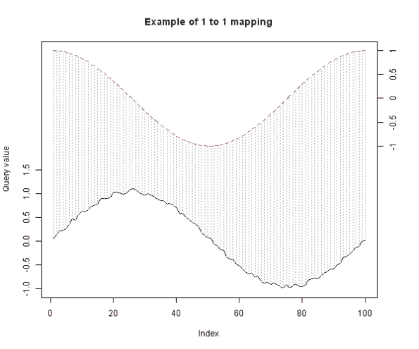
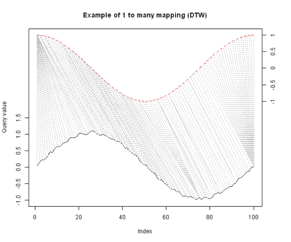
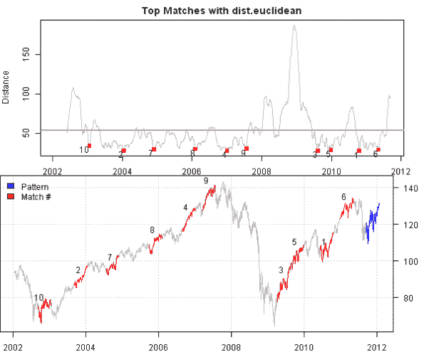
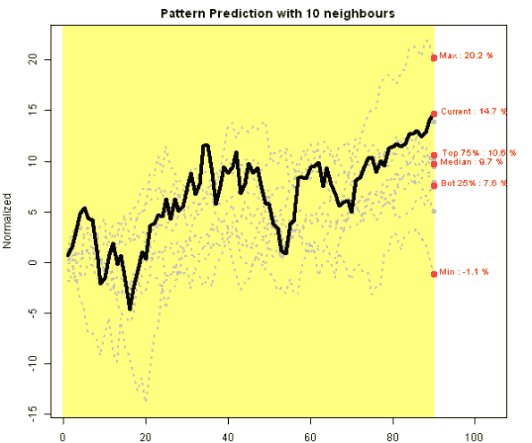
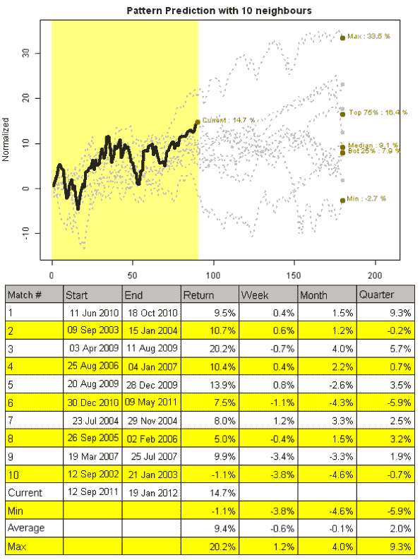
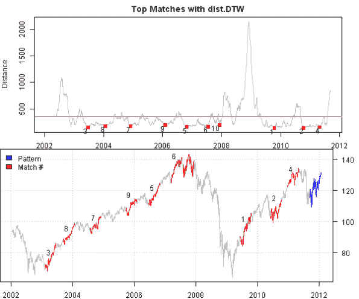
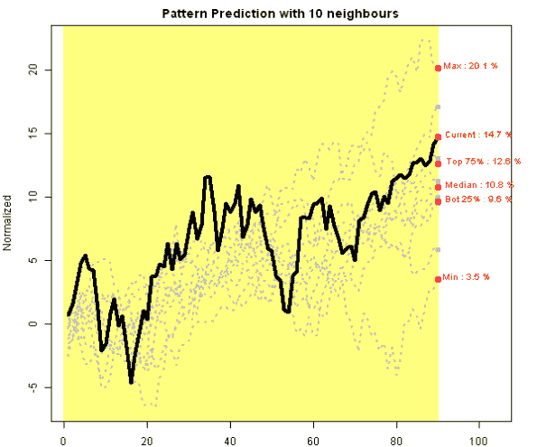
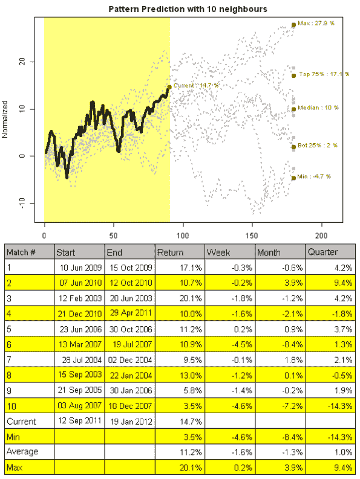

<!--yml
category: 未分类
date: 2024-05-18 14:43:23
-->

# Time Series Matching with Dynamic Time Warping | Systematic Investor

> 来源：[https://systematicinvestor.wordpress.com/2012/01/20/time-series-matching-with-dynamic-time-warping/#0001-01-01](https://systematicinvestor.wordpress.com/2012/01/20/time-series-matching-with-dynamic-time-warping/#0001-01-01)

THIS IS NOT INVESTMENT ADVICE. The information is provided for informational purposes only.

In the [Time Series Matching](https://systematicinvestor.wordpress.com/2012/01/13/time-series-matching/) post, I used one to one mapping to the compute distance between the query(current pattern) and reference(historical time series). Following chart visualizes this concept. The distance is the sum of vertical lines.

[](https://systematicinvestor.wordpress.com/wp-content/uploads/2012/01/plot0-small.png)

An alternative way to map one time series to another is [Dynamic Time Warping(DTW)](http://en.wikipedia.org/wiki/Dynamic_time_warping). DTW algorithm looks for [minimum distance mapping](http://www.cse.unsw.edu.au/~waleed/phd/html/node38.html) between query and reference. Following chart visualizes one to many mapping possible with DTW.

[](https://systematicinvestor.wordpress.com/wp-content/uploads/2012/01/plot1-small3.png)

To check if there a difference between simple one to one mapping and DTW, I will search for time series matches that are similar to the most recent 90 days of SPY in the last 10 years of history. Following code loads historical prices from Yahoo Fiance, setups the problem and computes Euclidean distance for the historical rolling window using the [Systematic Investor Toolbox](https://systematicinvestor.wordpress.com/systematic-investor-toolbox/):

```

###############################################################################
# Load Systematic Investor Toolbox (SIT)
# https://systematicinvestor.wordpress.com/systematic-investor-toolbox/
###############################################################################
con = gzcon(url('http://www.systematicportfolio.com/sit.gz', 'rb'))
    source(con)
close(con)

	#*****************************************************************
	# Load historical data
	#****************************************************************** 
	load.packages('quantmod')	
	tickers = 'SPY'

	data = getSymbols(tickers, src = 'yahoo', from = '1950-01-01', auto.assign = F)

	#*****************************************************************
	# Euclidean distance, one to one mapping
	#****************************************************************** 
	obj = bt.matching.find(Cl(data), normalize.fn = normalize.mean, dist.fn = 'dist.euclidean', plot=T)

	matches = bt.matching.overlay(obj, plot.index=1:90, plot=T)

	layout(1:2)
	matches = bt.matching.overlay(obj, plot=T, layout=T)
	bt.matching.overlay.table(obj, matches, plot=T, layout=T)

```

[](https://systematicinvestor.wordpress.com/wp-content/uploads/2012/01/plot2-small2.png)

[](https://systematicinvestor.wordpress.com/wp-content/uploads/2012/01/plot3-small2.png)

[](https://systematicinvestor.wordpress.com/wp-content/uploads/2012/01/plot4-small1.png)

Next, let’ examine the top 10 matches using Dynamic Time Warping distance. I will use the Dynamic Time Warping implementation from [dtw](http://dtw.r-forge.r-project.org/) package.

```

	#*****************************************************************
	# Dynamic time warping distance	
	#****************************************************************** 
	# http://en.wikipedia.org/wiki/Dynamic_time_warping
	# http://dtw.r-forge.r-project.org/
	#****************************************************************** 
	load.packages('dtw')

	obj = bt.matching.find(Cl(data), normalize.fn = normalize.mean, dist.fn = 'dist.DTW', plot=T)

	matches = bt.matching.overlay(obj, plot.index=1:90, plot=T)

	layout(1:2)
	matches = bt.matching.overlay(obj, plot=T, layout=T)
	bt.matching.overlay.table(obj, matches, plot=T, layout=T)

```

[](https://systematicinvestor.wordpress.com/wp-content/uploads/2012/01/plot5-small.png)

[](https://systematicinvestor.wordpress.com/wp-content/uploads/2012/01/plot6-small.png)

[](https://systematicinvestor.wordpress.com/wp-content/uploads/2012/01/plot7-small.png)

Both algorithms produced very similar matches and very similar predictions. I would use these predictions as an educated guess to market action going forward. So far, it looks like the market will not be going up in full throttle in the next 22 days.

To view the complete source code for this example, please have a look at the [bt.matching.dtw.test() function in bt.test.r at github](https://github.com/systematicinvestor/SIT/blob/master/R/bt.test.r).