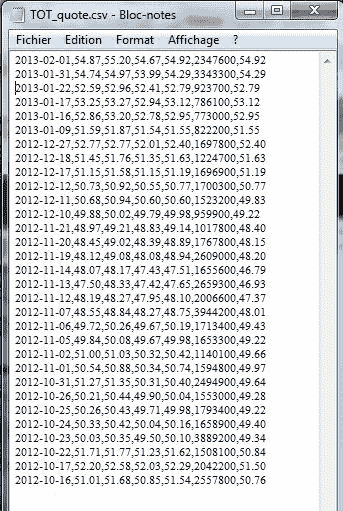

<!--yml
category: 未分类
date: 2024-05-18 08:07:40
-->

# Time series & QuantLib | Quant Corner

> 来源：[https://quantcorner.wordpress.com/2013/02/10/an-example-code-using-quantlib-timeseries/#0001-01-01](https://quantcorner.wordpress.com/2013/02/10/an-example-code-using-quantlib-timeseries/#0001-01-01)

We wrote an example code implementing the **TimeSeries** class of the **QuantLib** library.

This code actually parses a ***.csv** file that contains a time downloaded from **Yahoo! Finance**. Each line in the file contains a date and the corresponding open, high, low, close, volume and adjusted close.

Here, the **QuantLib::TimeSeries** object is created using the adjusted close, but the code is easy to adapt for other needs.

Below is the code, the results outputted to the console, and the source data file.

```
/*
Copyright (C) 2013, Edouard 'tagoma' Tallent
QL timeseries wrapper 
QuantCorner @ https://quantcorner.wordpress.com
*/

#include
#include
#include
#include
#include<boost\algorithmstring.hpp>
#include<ql\quantlib.hpp>

QuantLib::TimeSeries<double> PriceSeries(char* filename)
{
    // Read the file provided via command line
    std::ifstream in (filename);
    std::string line;
    std::vector lines;
    while (in >> line)
        lines.push_back(line);

    // Container tools
    std::vector dates;
    std::vector quotes;

    for (unsigned int i = 0; i < lines.size(); i++)
        {
            std::vector outerArray;

            boost::split(outerArray, lines[i], boost::is_any_of(","));

            std::vector innerArray;
            boost::split(innerArray, outerArray[0], boost::is_any_of("-")); 

            QuantLib::Year year = (QuantLib::Year) std::stoi(innerArray[0]);
            QuantLib::Month month = (QuantLib::Month) std::stoi(innerArray[1]);
            QuantLib::Day day = (QuantLib::Day) std::stoi(innerArray[2]);

            dates.push_back(QuantLib::Date(day, month, year));
            quotes.push_back(atof(outerArray[6].c_str()));
        }

    // Create a QuantLib::TimeSeries object
    QuantLib::TimeSeries series(dates.begin(), dates.end(), quotes.begin());

    // Return the time series
    return series;
}

int main(int argc, char *argv[])
{
    // Source file
    char* filename = argv[1];

    // Call to the function
    QuantLib::TimeSeries mySeries = PriceSeries(filename);

    ///////////////////////////////////////////////////////////////
    // Below are implementations of some methods of QL Timeseries//
    ///////////////////////////////////////////////////////////////

    // Is the time series empty?
    std::cout << "Is the series empty? (0 = not empty)\t" << mySeries.empty() << std::endl;

    // Start date of the time series
    std::cout << "Start date of the time series:\t" << mySeries.firstDate() << std::endl;

    // Last date of the time series
    std::cout << "Last date of the time series:\t" << mySeries.lastDate() << std::endl;

    // What was the Adj.close value on November 14th, 2012?
    std::cout << "Adjusted close on November 14th, 2012:\t" << mySeries[QuantLib::Date(14, QuantLib::Nov, 2012)] << std::endl;

    return 0;
}

```

[](https://quantcorner.wordpress.com/wp-content/uploads/2013/02/ql_timeseries_source.jpg)

*Many thanks to the guys at Wilmott for their tips, and to Daniel Duffy (one of the authors of [Introduction to the Boost C++ Libraries](http://www.datasim-press.com/BoostVolumeI.html "Introduction to the Boost C++ Libraries")) for answering all my questions.*