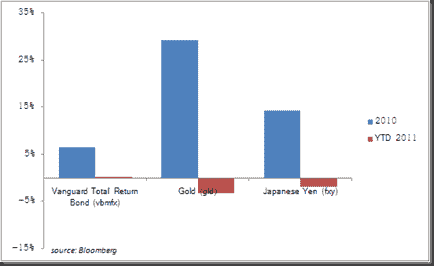

<!--yml
category: 未分类
date: 2024-05-18 15:24:52
-->

# Timely Portfolio: “Dumb Money”

> 来源：[http://timelyportfolio.blogspot.com/2011/01/dumb-money.html#0001-01-01](http://timelyportfolio.blogspot.com/2011/01/dumb-money.html#0001-01-01)

In the financial industry, there always seems to be a discussion about “Dumb Money.”  Generally, “Dumb Money” is used to describe the retail investor, but based on [Ned Davis Research](http://www.ndr.com), all stock price gains over the last 50 years came when there were inflows to equity mutual funds, so this would indicate “Dumb Money” might actually be “Smart Money.”

Also, it seems that “Dumb Money” is always the money made by someone else with a view opposite of yours.  Jealousy and bitterness often seems to be the source of this “Dumb Money” classification.  John Hussman seemed to fall in this category with this [weekly commentary "Profiting from the Tooth Fairy"](http://www.hussmanfunds.com/wmc/wmc090803.htm), which with hindsight seems clearly wrong.  However, his definition of “Dumb Money” in this same post probably fits very well with mine

> “‘catching’ gains from speculative investment themes that have a high probability of collapsing” or (my addition) where risk dramatically exceeds potential returns.

With this in mind, what was the “Dumb Money” last year?  I think US bonds, gold, and Japanese Yen, but I might just be bitter or jealous.  By the end of 2011, we’ll know the truth.

*1 hour*