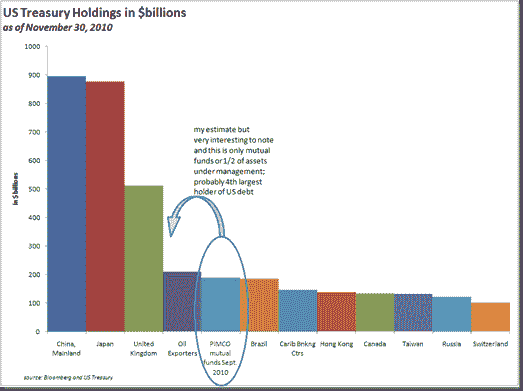
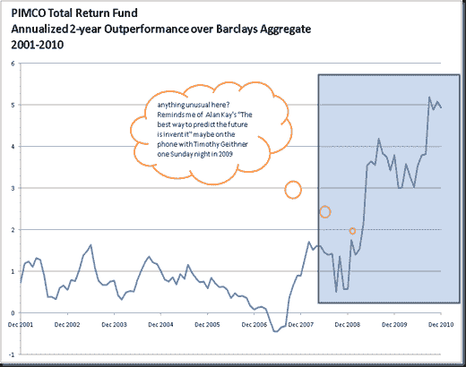

<!--yml
category: 未分类
date: 2024-05-18 15:24:19
-->

# Timely Portfolio: 4th Largest Holder of US Treasuries? PIMCO

> 来源：[http://timelyportfolio.blogspot.com/2011/01/4th-largest-holder-of-us-treasuries.html#0001-01-01](http://timelyportfolio.blogspot.com/2011/01/4th-largest-holder-of-us-treasuries.html#0001-01-01)

I have to admit that I have been startled by these articles on Bill Gross and his boast of home phone calls from the US Treasury Secretary--what I would call “inside information” (apparently perfectly legal in bond management).

[http://www.nytimes.com/2009/06/21/business/21gross.html?_r=1&pagewanted=all](http://www.nytimes.com/2009/06/21/business/21gross.html?_r=1&pagewanted=all "http://www.nytimes.com/2009/06/21/business/21gross.html?_r=1&pagewanted=all")

[http://www.theglobeandmail.com/report-on-business/managing/the-lunch/the-obsessive-life-of-bond-guru-bill-gross/article1769691/](http://www.theglobeandmail.com/report-on-business/managing/the-lunch/the-obsessive-life-of-bond-guru-bill-gross/article1769691/ "http://www.theglobeandmail.com/report-on-business/managing/the-lunch/the-obsessive-life-of-bond-guru-bill-gross/article1769691/")

This is even more concerning given PIMCO’s huge holdings in US Treasury bonds, which it appears they intentionally try not to aggregate for public consumption.  I tried to compile the numbers on total holdings, and my best estimate based on mutual fund holdings is $180 billion and over $250 billion applying the allocation to other managed accounts.  It looks something like this.

And then strangely enough, when we examine outperformance of PIMCO Total Return Fund over the Barclays Aggregate, something stands out slightly

I certainly don’t know what happened, but I like to point out odd things that go unquestioned especially when they deal with $1/4 Trillion of US Treasuries.  Please let me know if you have any insight.

*2.5 hours*