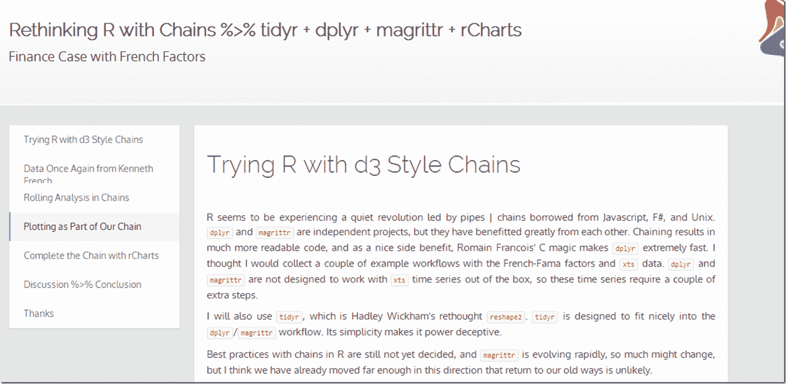

<!--yml
category: 未分类
date: 2024-05-18 14:53:10
-->

# Timely Portfolio: A Whole New R World with Chains and Pipes

> 来源：[http://timelyportfolio.blogspot.com/2014/06/a-whole-new-r-world-with-chains-and.html#0001-01-01](http://timelyportfolio.blogspot.com/2014/06/a-whole-new-r-world-with-chains-and.html#0001-01-01)

I think that the recent shift in the R world to chains and pipes will become permanent.  Even if not, this style of code translates well to Javascript and other languages.  I thought a finance example exploring Fama/French factors with dplyr, magrittr, tidyr, and rCharts would help me learn and think through new workflows.

