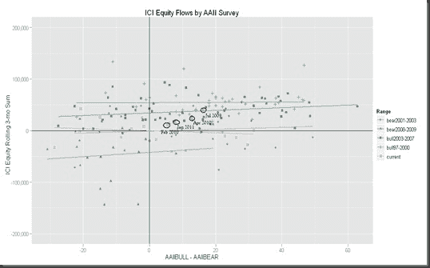

<!--yml
category: 未分类
date: 2024-05-18 15:22:16
-->

# Timely Portfolio: Additional Analysis of AAII Survey vs ICI Equity Flows

> 来源：[http://timelyportfolio.blogspot.com/2011/02/additional-analysis-of-aaii-survey-vs.html#0001-01-01](http://timelyportfolio.blogspot.com/2011/02/additional-analysis-of-aaii-survey-vs.html#0001-01-01)

I don’t want to belabor this, but I thought it might be helpful to associate the recent bullish inflow points to their corresponding place on the S&P 500 chart.  Below are the graphs.

via [StockCharts.com](http://stockcharts.com/h-sc/ui?s=%24spx&p=w&yr=2&mn=0&dy=0&id=p14511701061&a=224138401)