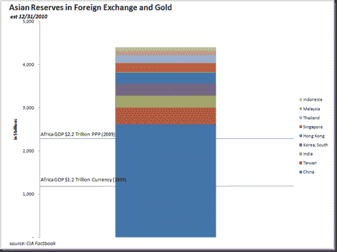

<!--yml
category: 未分类
date: 2024-05-18 15:22:32
-->

# Timely Portfolio: Africa

> 来源：[http://timelyportfolio.blogspot.com/2011/02/africa.html#0001-01-01](http://timelyportfolio.blogspot.com/2011/02/africa.html#0001-01-01)

Over the last couple of years as China and Emerging Asia have steadily directed their reserves to poor investments in bonds in the developed world, I have wondered when they would decide that investment in themselves and Africa would be more beneficial.  My reading on the African situation since decolonization in the 1960s has led me to conclude that its biggest issue was the lack of commitment from a stable source of capital.  This stable source of capital could very easily be long-term focused reserve funds of Asian nations.  If Asian reserve funds are willing to pursue bad investments for the long-term, it seems they should be very willing to pursue good investments despite short-term fluctuations.

[Newsweek’s article How Africa is Becoming the New Asia](http://www.newsweek.com/2010/02/18/how-africa-is-becoming-the-new-asia.html) offers two very interesting statistics in a great article:

> China and India get all the headlines for their economic prowess, but there's another global growth story that is easily overlooked: Africa. In 2007 and 2008, southern Africa, the Great Lakes region of Kenya, Tanzania, and Uganda, and even the drought-stricken Horn of Africa had GDP growth rates on par with Asia's two powerhouses. Last year, in the depths of global recession, the continent clocked almost 2 percent growth, roughly equal to the rates in the Middle East, and outperforming everywhere else but India and China. This year and in 2011, Africa will grow by 4.8 percent—the highest rate of growth outside Asia, and higher than even the oft-buzzed-about economies of Brazil, Russia, Mexico, and Eastern Europe, according to newly revised IMF estimates. In fact, on a per capita basis, Africans are already richer than Indians, and a dozen African states have higher gross national income per capita than China.
> 
> A recent study by Oxford economist Paul Collier of all 954 publicly traded African companies operating between 2000 and 2007 found that their annual return on capital was on average 65 percent higher than those of similar firms in China, India, Vietnam, or Indonesia because labor costs are skyrocketing in Asia. Their median profit margin, 11 percent, was also higher than in Asia or South America.

Some other interesting graphs come from [McKinsey's Lions on the Move](http://www.mckinsey.com/mgi/publications/progress_and_potential_of_african_economies/index.asp)

[")](https://blogger.googleusercontent.com/img/b/R29vZ2xl/AVvXsEjYQujM6zSIS_2PZmGmEe8WTHnHx-XdNlCepMnM6mIiUQMGSA778X9kJwyxqFWr_2NZEyDDL9MzSJnQ7Um7XB1C7yn2JkCGEdxEOoVMj_ile-6Yyq8hWuChfk7_2vqmiMXjU4bFCyHs2w/s1600-h/ScreenClip16.png)[")](https://blogger.googleusercontent.com/img/b/R29vZ2xl/AVvXsEi_F6tyyjL-czGOm3ksJkeC5C7Es7LwRUR1bNcs3i6pEJxXq5D9stfrnTzTxzCebhPPHeiFW6K5Xcrv-_0fT5tmPU0Akp1XSQp6EMYyNUM7xXdwlXoDykLuwJC9crU9LROqRcYqFgbeKg/s1600-h/ScreenClip25.png)[")](https://blogger.googleusercontent.com/img/b/R29vZ2xl/AVvXsEhP15_owQDWFPDiONbGG2O0idWBrcAPKK2MGrZYn2_N3GgFqSNCbRshqjB8C145AW3iiIFqTxxDrgmnF4DaKi50JsVGFDApqxOpTd7jcU_Ououd4pjQjsSDJ0VC8ZSPCef2CO3sNi7g1Q/s1600-h/ScreenClip36.png)

And this article in Forbes [Asia Should Buy Into Africa's Growth](http://www.forbes.com/2010/08/12/asia-china-africa-trade-growth-markets-economy-investment_print.html) finally gets to my point, stop buying mutually sacrificial developed bonds Asia and seek mutually beneficial investments in Africa.

*2.5 hours*