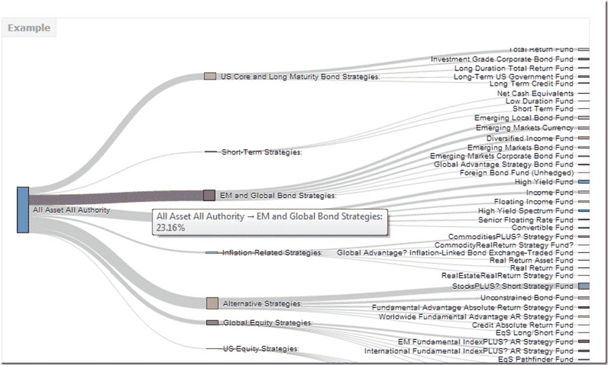
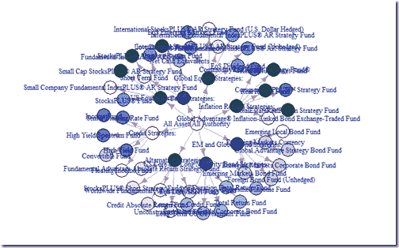
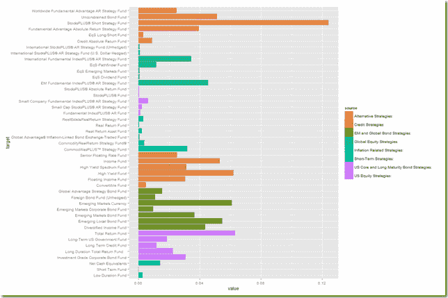

<!--yml
category: 未分类
date: 2024-05-18 14:59:00
-->

# Timely Portfolio: All My Roads Lead Back to Finance–PIMCO Sankey

> 来源：[http://timelyportfolio.blogspot.com/2013/07/all-my-roads-lead-back-to-financepimco.html#0001-01-01](http://timelyportfolio.blogspot.com/2013/07/all-my-roads-lead-back-to-financepimco.html#0001-01-01)

Even though the route might be circuitous, my seemingly random journeys all seem to lead back to finance.  My fun with

[rCharts](http://rcharts.io/site)

sankey diagrams (

[Exploring Networks with Sankey](http://timelyportfolio.blogspot.com/2013/07/exploring-networks-with-sankey.html)

) has led me into an exploration of the

[PIMCO](http://www.pimco.com/Pages/default.aspx)

network.  Although PIMCO is best known for its fixed income products, PIMCO has broadened its product offerings beyond bonds.  This shift away from bonds goes back much farther than the highly publicized moves in 2009-2010 (

[Risk.net “Interview: Bill Gross, PIMCO”](http://www.risk.net/credit/interview/1590278/interview-bill-gross-pimco)

) to the 2002 launches of the PIMCO CommodityRealReturn Strategy (“

[Pimco Dreams Up Funds to Overcome The Nightmare of Inflation](http://online.wsj.com/article/SB111222346650493613.html)

”) and PIMCO All Asset Fund ( “

[PIMCO, Arnott team to offer an 'unusual' TAA mutual fund](http://connection.ebscohost.com/c/articles/7509039/pimco-arnott-team-offer-unusual-taa-mutual-fund)

”, “

[Investing Without Blinders](http://www.businessweek.com/stories/2003-09-14/investing-without-blinders)

” and “

[PIMCO All Asset Shies From Stocks](http://www.thinkadvisor.com/2003/08/19/pimco-all-asset-shies-from-stocks)

”).

The PIMCO All Asset funds are managed by

[Research Affiliates](http://www.researchaffiliates.com/)

Robert Arnott and invest only in other PIMCO mutual funds rather than individual securities, so in many ways the fund’s success is dependent on the quality and breadth of other PIMCO funds.  Since it sounds slightly incestuous, I thought it would be a good subject for my new tools—sankey diagrams and basic network analysis.

#### Excel to Edgelist with Old-school VBA

Since PIMCO (and nobody else for that matter) doesn’t provide holdings in an igraph readable edgelist, I decided to revive some fond memories and use VBA to convert the

[spreadsheet](http://investments.pimco.com/ShareholderCommunications/External%20Documents/PIMCO%20Bond%20Stats.xls)

into a 3 column edgelist (source, target, value).  Even though I am embarrassed by my VBA code, I will show it below.

```
 Sub getedgelist()
    Dim clInfo As Range, clWrite As Range, tempcl As Range
    Dim offsetamt As Integer

    'this will be used throughout to indicate columns to offset for desired date
    'watch out for hidden rows
    offsetamt = 15

    'clInfo will be the cell with our reference information
    Set clInfo = ThisWorkbook.ActiveSheet.Range("a9")
    'clWrite will be the cell where we write the info that we gather
    Set clWrite = ThisWorkbook.ActiveSheet.Range("u9")

    Do Until clInfo = "Total Gross Asset Allocation"
        'looking at formatting is probably the easiest way to determine if group or fund
        'I chose indent to determine if group or fund
        'IndentLevel = 0 for groups and 1 for funds
        If clInfo.IndentLevel = 0 Then
            'if we are on a group write in clWrite the group and each fund within the group
            'with group as source and fund as target
            'we will loop until we are at the next group
            Set tempcl = clInfo
            'write mutual fund as source, group as target, and weight
            clWrite.Value = ThisWorkbook.ActiveSheet.Range("e6").Value
            clWrite.Offset(0, 1).Value = clInfo.Value
            clWrite.Offset(0, 2).Value = clInfo.Offset(0, offsetamt).Value
            Set clWrite = clWrite.Offset(1, 0)
            Do Until tempcl.Offset(1, 0).IndentLevel = 0
                'now loop through each fund in group
                'write group as source, held fund as target, and weight
                clWrite.Value = clInfo.Value
                clWrite.Offset(0, 1).Value = tempcl.Offset(1, 0).Value
                clWrite.Offset(0, 2).Value = tempcl.Offset(1, offsetamt).Value
                'next cell down
                Set tempcl = tempcl.Offset(1, 0)
                Set clWrite = clWrite.Offset(1, 0)
            Loop
            Set clInfo = clInfo.Offset(1, 0)
        Else

        End If
        'if we are on a group write in clWrite the group and each fund within the group
        'with group as source and fund as target
        Debug.Print (clInfo)
        Set clInfo = clInfo.Offset(1, 0)
    Loop
End Sub
```

Now we have everything we need to do the sankey diagram in R.

```
 #sankey of PIMCO All Asset All Authority holdings
#data source http://investments.pimco.com/ShareholderCommunications/External%20Documents/PIMCO%20Bond%20Stats.xls

require(rCharts)

#originally read the data from clipboard of Excel copy
#for those interested here is how to do it
#read.delim(file = "clipboard")

holdings = read.delim("http://timelyportfolio.github.io/rCharts_d3_sankey/holdings.txt", skip = 3, header = FALSE, stringsAsFactors = FALSE)
colnames(holdings) <- c("source","target","value")

#get rid of holdings with 0 weight or since copy/paste from Excel -
holdings <- holdings[-which(holdings$value == "-"),]
holdings$value <- as.numeric(holdings$value)

#now we finally have the data in the form we need
sankeyPlot <- rCharts$new()
sankeyPlot$setLib('http://timelyportfolio.github.io/rCharts_d3_sankey')

sankeyPlot$set(
  data = holdings,
  nodeWidth = 15,
  nodePadding = 10,
  layout = 32,
  width = 750,
  height = 500,
  labelFormat = ".1%"
)

sankeyPlot
```

Blogger makes it hard to incorporate d3 directly into this post, so click

[here](http://rcharts.io/viewer/?6022406#.UebN9I3VCSp)

or on the screenshot below, to engage and interact with the sankey.

[](http://rcharts.io/viewer/?6022406#.UebN9I3VCSp)

Just for good measure, here is the default plot from igraph.

[](https://blogger.googleusercontent.com/img/b/R29vZ2xl/AVvXsEivNSO1J0xZ_BCHssqfHK5wVxyept1W1EOhML9dcztVRMgNfC2-FAR62Wc_AW0s-NlOtIa458XD-NlBYOj1jfMWvFgh2NaqHc90k5k4-LC4WcJI0wJOPLsfUMttKvuj2PZ8Nvi1PlyzZg/s1600-h/image%25255B27%25255D.png)

Of course we could also plot the data a little more traditionally with a ggplot2 bar chart.

[](https://blogger.googleusercontent.com/img/b/R29vZ2xl/AVvXsEiTgJunOVBCihYvbODsP36fGppWzpRpjgfQj9bWzSyJpTiaTDQJM9RbFx7cVPlhC3ywiK5W1wfB-IH8qUpHRhgYTVPnEkanpMNenq2WQtyn_NZUPtKFc2NLNiTrUgw_tbmnsuip2VTM4w/s1600-h/image%25255B10%25255D.png)

Any way we look at it, we can see that PIMCO now has way more than just bonds and the fund All Asset All Authority uses almost everything.