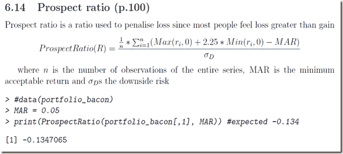

<!--yml
category: 未分类
date: 2024-05-18 15:03:42
-->

# Timely Portfolio: Another Great Google Summer of Code 2012 R Project

> 来源：[http://timelyportfolio.blogspot.com/2012/08/another-great-google-summer-of-code.html#0001-01-01](http://timelyportfolio.blogspot.com/2012/08/another-great-google-summer-of-code.html#0001-01-01)

[Tradeblotter announced](http://tradeblotter.wordpress.com/2012/08/29/now-with-more-bacon-2008/) the very nice features that will be added to the PerformanceAnalytics package as a result of the Google Summer of Code (GSOC) 2012 project:

> “…Matthieu commenced to produce dozens of new functions, extend several more existing ones, and add more than 40 pages of additional documentation (complete with formulae and examples) to PerformanceAnalytics. He’s included Bacon’s small data set and several new `table.*` functions for testing and demonstrating that the functions match the published results. All on plan, I would add.
> 
> He also wrote [a very nice overview](http://tradeblotter.files.wordpress.com/2012/08/pa-bacon.pdf) of the functions developed from Bacon (2008) that are included in PerformanceAnalytics, which should be helpful to readers or teachers of Bacon’s work. Matthieu’s summary document will also be distributed as a vignette in the package, accessible using `vignette('PA-Bacon')`. Additional detail is included in the documentation for each function, as well. I’ll highlight some of those functions in later posts…”

Although the Bacon vignette is very helpful, I highly recommend reading the book also.  For those of you on O’Reilly’s Safari, you can add the book to your bookshelf.

[Preview
](http://my.safaribooksonline.com/9781119995470/firstsection?portal=oreilly&uicode=&__hideTop=true&__readerfullscreen=1&__readerleftmenu=1&flashzoom=0&cid=shareWidgetUse "Practical Portfolio Performance Measurement and Attribution, Second Edition")

or buy it from Amazon.

Since I saw the announcement (been patiently waiting) when I was also reading this very good article [“Tomatoes and the Low Vol Effect” by Research Affiliates](http://advisorperspectives.com/commentaries/research_82812.php), I was already working on some R to explore the Sharpe and Information Ratio between a buy/hold on the S&P 500 and a 10 month moving average strategy.  When you look at the code, you might enjoy some of the other charts and methods, but  I decided to change directions with my research and integrate a new PerformanceAnalytics function and continue to push the limits with another fine Google Summer of Code 2012 addition [xtsExtra plot.xts](http://timelyportfolio.blogspot.com/search/label/plot.xts).  I was not real selective and opted for ProspectRatio, since it is a formula I do not often hear discussed.  On page 20, the Bacon vignette describes ProspectRatio as

I basically tried to include absolutely everything possible (scattered, smothered, covered, chunked, and diced) from [xtsExtra plot.xts](http://timelyportfolio.blogspot.com/search/label/plot.xts) in this chart.  The chart includes cumulative growth of buy/hold and 10 month moving average on the S&P 500 in the top panel, shows drawdown in the middle, and then adds a horizon plot of Prospect Ratio for the ma strategy – Prospect Ratio for the buy/hold.  Since plot.xts also allows for blocks, I thought it would be helpful to also shade those periods when the 36 month rolling Sharpe Ratio of the ma strategy outperforms buy/hold.  While this is probably a bit much for a single chart, I think it demonstrates clearly how powerful these tools are.

[R code from GIST (do raw for copy/paste):](https://gist.github.com/3529477)