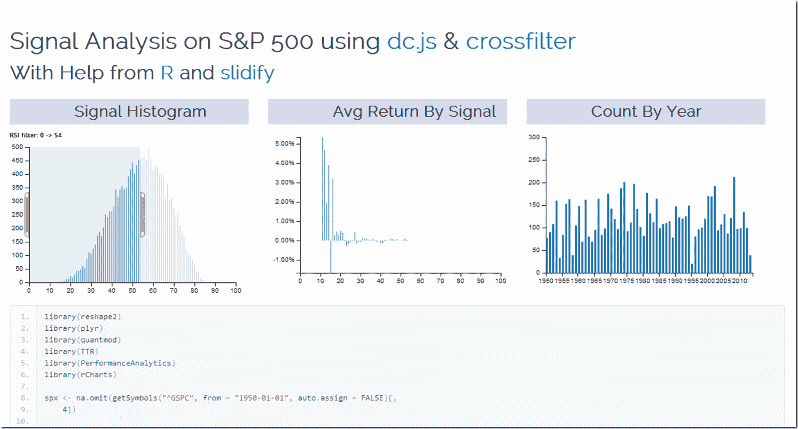
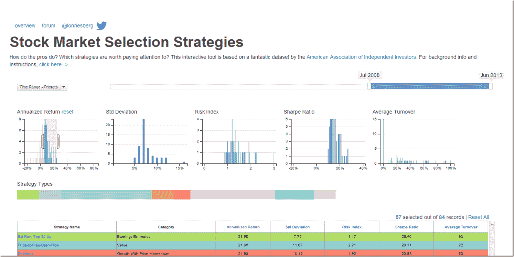

<!--yml
category: 未分类
date: 2024-05-18 14:57:46
-->

# Timely Portfolio: Applications of Interactivity to Finance

> 来源：[http://timelyportfolio.blogspot.com/2013/08/applications-of-interactivity-to-finance.html#0001-01-01](http://timelyportfolio.blogspot.com/2013/08/applications-of-interactivity-to-finance.html#0001-01-01)

Of the nearly infinite ways of using [crossfilter](http://square.github.io/crossfilter/) and [dc.js](http://nickqizhu.github.io/dc.js/) in finance, the 2 that immediately came to my mind are signal analysis in system building and money manager analysis in due diligence.  My first very basic experiment explores a commonly known signal (RSI) on the daily S&P 500 since 1950.  Interactivity adds a lot to the experience.  I used R to grab and reshape the data and [slidify](http://slidify.org) to make it pretty.  Check it out by clicking [here](http://timelyportfolio.github.io/rCharts_crossfilter_dcjs/signal_slidify.html) or on the screenshot below.

For another very fine example of dc.js and crossfilter in use with AAII Stockpicking strategy data, see this [fine site](http://www.acrodatics.com/).

