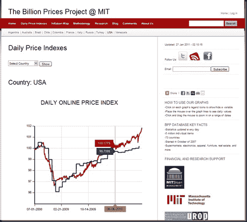

<!--yml
category: 未分类
date: 2024-05-18 15:23:36
-->

# Timely Portfolio: Billion Prices Project @ MIT – Watch out Bonds and CPI!!!!

> 来源：[http://timelyportfolio.blogspot.com/2011/01/billion-prices-project-mit-watch-out.html#0001-01-01](http://timelyportfolio.blogspot.com/2011/01/billion-prices-project-mit-watch-out.html#0001-01-01)

This is an extremely valuable set of information particularly when it shows something not being priced in to the markets, especially bonds.  I have been checking weekly/monthly waiting for a pop, and here it is.  Watch out bonds and CPI!

Everyone please go to the site and play with the numbers for yourself.  Also, please share this with anyone who cares.

*20 minutes*