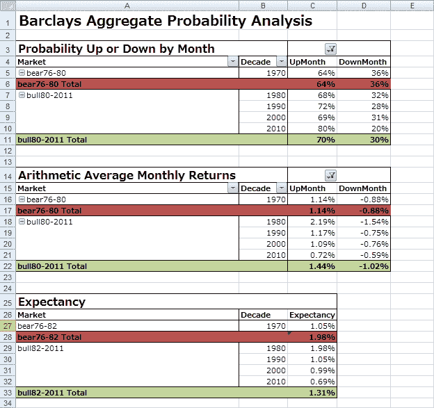
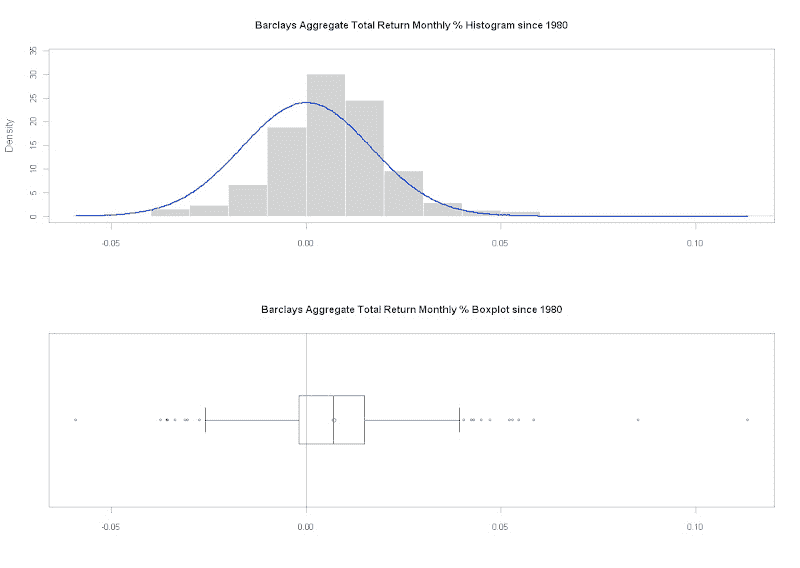

<!--yml
category: 未分类
date: 2024-05-18 15:19:09
-->

# Timely Portfolio: Bond Market as a Casino Game Part 1

> 来源：[http://timelyportfolio.blogspot.com/2011/04/bond-market-as-casino-game-part-1.html#0001-01-01](http://timelyportfolio.blogspot.com/2011/04/bond-market-as-casino-game-part-1.html#0001-01-01)

With this post, I am doing something I try very hard to avoid, especially when communicating to my clients, and that is blurring the line between investing and gambling.  But after reading all of [Reuven Brenner’s](http://www.amazon.com/gp/product/0521711576/ref=as_li_qf_sp_asin_il_tl?ie=UTF8&tag=timelyp-20&linkCode=as2&camp=1789&creative=9325&creativeASIN=0521711576) books and finishing [Ralph Vince *Leverage Space Trading Model*](http://www.amazon.com/gp/product/0470455950/ref=as_li_qf_sp_asin_il_tl?ie=UTF8&tag=timelyp-20&linkCode=as2&camp=1789&creative=9325&creativeASIN=0470455950), I think blurring the line can offer additional insights and methods not traditionally available.

As a starting point, let’s apply basic probability methods on the most widely used bond index Barclays Aggregate Total Return to test my belief that the 1980-current bull run in bonds has offered one of the best games ever for any investor in the history of the markets (see my post [“Bonds Tumble and Questions Start Getting Asked”](http://timelyportfolio.blogspot.com/2010/12/bonds-tumble-and-questions-start.html)).  In the Microsoft Excel pivot table shown below, the Barclays Aggregate has been up 70% of all month since 1980, and the up months generate on average 1.44% return compared to the down months –1.02%.  If we put this in casino terms, it is like winning 7 of every 10 games with a payout of 1.4 to 1.

 

For another look, let’s use R and PerformanceAnalytics to see the histogram and boxplot.

|  |
| From [TimelyPortfolio](https://picasaweb.google.com/kentonlrussell/TimelyPortfolio02?feat=embedwebsite) |

*source:Barclays Capital and thanks to the fine contributors to R and PerformanceAnalytics*

Now that we have the basic probabilities secured, we can have all sorts of fun in later posts with the Leverage Space techniques and Monte Carlo simulations.

R code:

require(PerformanceAnalytics)
require(quantstrat)

#load index data given as date and total return value
BarAgg<-as.xts(read.csv("lbustruu.csv",row.names=1))

#convert to monthly return series for PerformanceAnalytics
#use discrete ROC to get simple monthly return
#((value this month-value last month)/value last month)-1
BarAggReturn<-ROC(BarAgg,n=1,"discrete")

par(mfrow=c(2,1)) #2 rows and 1 column
chart.Histogram(BarAggReturn["1980::"],main="Barclays Aggregate Total Return Monthly % Histogram since 1980",cex.main=1,xlab=NULL,breaks=15,methods="add.centered")
chart.Boxplot(BarAggReturn["1980::"],main="Barclays Aggregate Total Return Monthly % Boxplot since 1980",cex.main=1,xlab=NULL,names=FALSE)