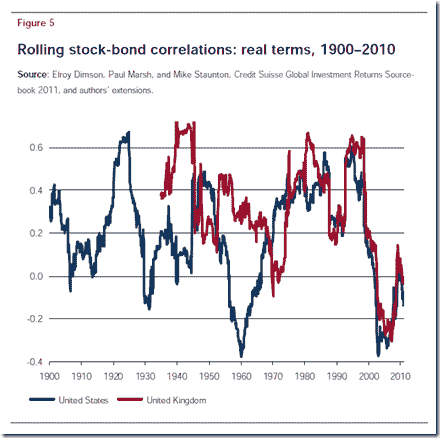
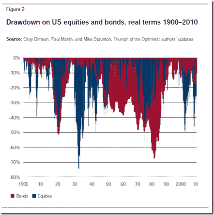

<!--yml
category: 未分类
date: 2024-05-18 15:03:54
-->

# Timely Portfolio: Bonds Much Sharpe -r Than Buffett

> 来源：[http://timelyportfolio.blogspot.com/2012/08/bonds-much-sharpe-r-than-buffett.html#0001-01-01](http://timelyportfolio.blogspot.com/2012/08/bonds-much-sharpe-r-than-buffett.html#0001-01-01)

Mebane Faber’s post [Buffett’s Alpha](http://www.mebanefaber.com/2012/08/21/buffetts-alpha/) points out Warren Buffett’s 0.76 Sharpe Ratio discussed in the similarly title paper [Buffet’s Alpha](http://www.econ.yale.edu/~af227/pdf/Buffett's%20Alpha%20-%20Frazzini,%20Kabiller%20and%20Pedersen.pdf "Buffet’s Alpha").  I of course immediately think about the 8th Wonder of the World – the US Bond Market, whose Sharpe Ratio has trounced Buffett’s for the last 30 years.  What I like even better are all the tactical systems that employ US bonds in their backtests and make no adjustment for substantially different returns going forward.  For those of you who do not know, bonds with absolute certainty cannot achieve >8% annualized returns with max drawdown < 5% for the next 30 years with a starting yield to worst at 1.86% (Barclays Agg 8/23/2012). 

**If anyone can show me where to get 8% annualized returns with max drawdown of 5% for the next 30 years, please let me know, and I will buy that with leverage and enjoy life. I’ll be happy to share my gains with whomever has the answer.**

In addition to an unbelievable Sharpe Ratio, bonds have exhibited a low/negative correlation with stocks during stocks’ bear market, which is also historically very anomalous.

Just because I love [horizon plots](http://timelyportfolio.blogspot.com/search/label/horizonplot).

For a longer perspective, here is rolling correlation since 1900 from the CSFB 2011 Yearbook.

So the experience can be dramatically different than what we have been fortunate enough to experience recently.

[R code from GIST (install xtsExtra):](https://gist.github.com/3440838)