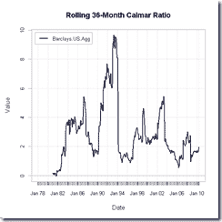
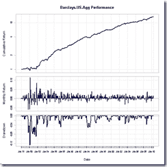

<!--yml
category: 未分类
date: 2024-05-18 15:27:25
-->

# Timely Portfolio: Bonds Tumble and Questions Start Getting Asked

> 来源：[http://timelyportfolio.blogspot.com/2010/12/bonds-tumble-and-questions-start.html#0001-01-01](http://timelyportfolio.blogspot.com/2010/12/bonds-tumble-and-questions-start.html#0001-01-01)

As bonds tumble, questions start getting asked, but the one most appropriate is “Am I getting compensated for the risk I am taking?'”  When risk exceeds returns, generally the outcome is not favorable over the long term.  Unfortunately after 30 years of outstanding excess bond returns with no real drawdowns, bonds seem riskless, and investors have chosen to aggressively pursue this perceived risklessness.  Basic analysis reveals that this decision is reckless not riskless.

Since December 1982 bonds as measured by the Barclays Aggregate Index have gained 8.5% per year with a maximum drawdown of 6% in 1994 and 4% after 1994.  This performance rivals or exceeds even the most successful hedge fund managers, dwarfs Warren Buffett, and has to offer one of the highest asset class Calmar ratios (annualized return divided by drawdown) of investing history.  In the chart below, Calmar ratio over 3 year periods never goes below 1 after 1982 and approaches 2 for the entire period 1982-2010.  Bond performance has been so good, your bond portfolio should be treated like winning a lottery.  After winning a lottery, the wise action is to recognize your good fortune and not use your winnings to buy more tickets.

*source:Barclays Capital and thanks to the fine contributors to R and PerformanceAnalytics*

So as you decide to cash in and reap your good fortune or to buy more bond tickets, please keep in mind:

1) Bonds will not perform well enough to achieve return targets, so long term outcome is guaranteed failure.

2) Bonds will incur significantly more volatility (generally the definition of risk) as yield is too low to sufficiently offset potential losses.

3) Bonds will not fit their intended purpose in a portfolio to protect principal first while providing income second and potentially offering real return third.  At current levels, bonds will not reach any of these goals.

And the real question to investors is “Where do I go next/now?”  Much more to come…

40 minutes