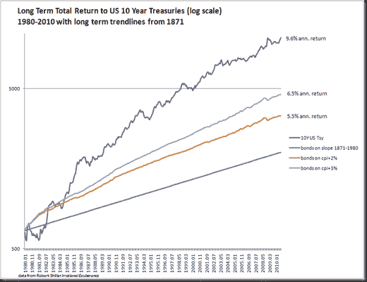

<!--yml
category: 未分类
date: 2024-05-18 15:25:39
-->

# Timely Portfolio: Bonds in Constrained Bubble

> 来源：[http://timelyportfolio.blogspot.com/2011/01/bonds-in-constrained-bubble.html#0001-01-01](http://timelyportfolio.blogspot.com/2011/01/bonds-in-constrained-bubble.html#0001-01-01)

I characterize a “bubble” as irrational overvaluation based on the belief that potential returns are infinite and pursued by uncharacteristic amounts of money.  Based on this definition, bonds cannot ever be a bubble because potential returns and overvaluation are mathematically constrained by the zero bound of interest rates.  However, after a 30 year run, bonds are a constrained bubble.  I have seen stocks graphed based on long term linear forecasts (most recently and beautifully in [Visualizing Economics](http://www.visualizingeconomics.com/ "Visualizing Economics")), but very rarely see a similar chart for bonds, so using the same [Shiller dataset](http://www.econ.yale.edu/~shiller/data.htm), I have plotted bonds with some interesting overlays.

**

That is a lot of lines, so let’s narrow it down to the experience since 1980 but keeping the long-term framework in mind.

or maybe we can look at bonds one more way in terms of price return on a 5 year rolling basis.  1980-2010 certainly stands out.

*2 hours*