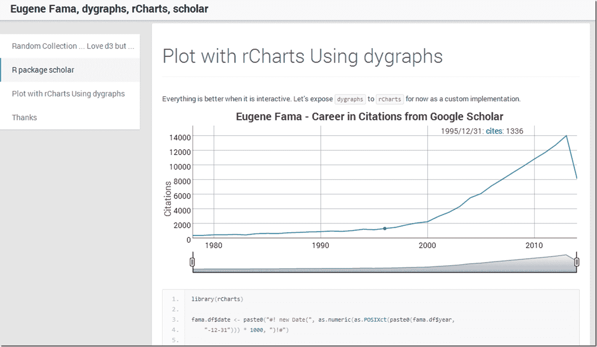

<!--yml
category: 未分类
date: 2024-05-18 14:56:20
-->

# Timely Portfolio: Combining Eugene Fama, rCharts, dygraphs, and scholar

> 来源：[http://timelyportfolio.blogspot.com/2013/10/combining-eugene-fama-rcharts-dygraphs.html#0001-01-01](http://timelyportfolio.blogspot.com/2013/10/combining-eugene-fama-rcharts-dygraphs.html#0001-01-01)

What better way to end the week than to dump a lot of random topics into some experiments.  Here is what [happened](http://timelyportfolio.github.io/research_scholar/).

