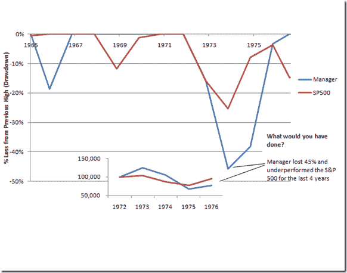

<!--yml
category: 未分类
date: 2024-05-18 15:13:57
-->

# Timely Portfolio: Confidence, Ending Equity, and What I Can Do as the Money Manager

> 来源：[http://timelyportfolio.blogspot.com/2011/06/confidence-ending-equity-and-what-i-can.html#0001-01-01](http://timelyportfolio.blogspot.com/2011/06/confidence-ending-equity-and-what-i-can.html#0001-01-01)

I wrote this as my quarterly commentary, but I thought I should share it as a general discussion piece.  More than on any post, I would absolutely love feedback and comments good or bad.

**Confidence, Money Management, and Your Wealth**

How would you respond if this were your money manager (revealed later) in 1974? Would you have added or subtracted money? Although I do not know your answer, I probably would have subtracted money or closed the account entirely.

[](https://blogger.googleusercontent.com/img/b/R29vZ2xl/AVvXsEi7MIF7ILf79teu_k7LXrXyifXWRBCRvOXYvDegvCpPqmOS2QD7u8wf0ofIlxV3susDhMOpBIKWLHkTXrJvqBXfJj50LRYQp2zxK7kMj2c5KL00AKxvgr_-VwGeyRUehyphenhyphenRadsiUoBZQUA/s1600-h/image%25255B7%25255D.png)

*Data Provided by Statman, Meir and Scheid, Jonathan, Buffett in Foresight and Hindsight (September 2001). Santa Clara University Working Paper No. 00/01-37.Available at SSRN:* [http://ssrn.com/abstract=277161](http://ssrn.com/abstract=277161 "http://ssrn.com/abstract=277161")

Your ending wealth depends much more on when and how much money you add or subtract than how well I perform. While I can manage risk and return as your money manager, I unfortunately cannot control this most important determinant of your ending wealth. Without confidence, money management fails, so what I do to build and maintain your confidence probably will build your wealth more than my geometrically linked returns. My method for building and maintaining your confidence and ultimately your ending wealth requires two elements: open honest communication and drawdown minimization.

1) Open honest communication requires your help, since the conversation needs to go both ways. I will continue to send quarterly updates and performance reports, but I also need to know your feelings, concerns, suggestions, questions, life changes, or really anything so I can help achieve your financial objectives. I am available by phone, email, mail, face-to-face, text message, Twitter, Skype, and IM.

2) In the chart above, my guess is your decision was based more on the money lost than the underperformance. Fear crushes confidence, and if I can keep drawdowns under 10-15%, then both the duration and magnitude of your fear will be greatly relieved.

How would you feel if you dumped Berkshire Hathaway and Warren Buffett in 1976? The manager in the above chart was Warren Buffett, and if you retained Buffett/Berkshire through 2010, you would have made $161 million more on an initial $100,000 investment than the S&P 500\. I in no way claim an ability to replicate Warren Buffett’s performance or management style, but I think this offers a good illustration of how even one of the world’s all-time best money managers could have lost his clients’ confidence and potentially impacted their ending net worth.

In Forbes Oct 29, 1998 The Berkshire Bunch, Buffett says "The first investors just believed in me. The ones who had faith stayed on; you couldn't get my Aunt Katie to sell if you came at her with a crowbar. But the people who came in later because they thought the stock was cheap and they were attracted to my record didn't always stay. It's a process of natural selection."

As I said, I would love to hear your thoughts. I limited the piece to one page, but another very good related piece can be found at

> Opportunities for Patient Investors, Jason Zwieg and Seth Klarman

> [Financial Analysts Journal, September/October 2010, Vol. 66, No. 5:18-28.](http://www.cfapubs.org/loi/faj)

I did the chart in Excel, but I thought I would include the [Buffett dataset (click for the file)](https://spreadsheets.google.com/spreadsheet/ccc?key=0Amqp2r96khJPdHJXZ1hwbVQ0UTAtMW4yNE9FMFMyamc&hl=en_US) in R also.  Here is what it looks like.

[R code (click to download):](https://docs.google.com/leaf?id=0B2qp2r96khJPMjYzYzBlNDYtOTNmYy00ZjRjLTg1YjAtZTkxNjVmNWZiMzA3&hl=en_US)

```
require(quantmod)
require(PerformanceAnalytics)
require(ggplot2)   berkshire_sp500 <- read.csv("berkshire_and_sp500.csv",stringsAsFactors=FALSE)
berkshire_sp500 <- as.xts(berkshire_sp500[,2:3],order.by=as.Date(berkshire_sp500[,1]))   #annual data unfortunately does not work with PerformanceAnalytics
#so these won't look as good as I would like   #calculate growth of $1
#first step is getting returns
cumPerf <- ROC(berkshire_sp500,n=1,type="discrete")
#remove na from start of series
cumPerf[1,] <- 0
#second step is calculating the cumulative product of returns
#or geometrically link the periodic returns
cumPerf[,1] <- cumprod(1+cumPerf[,1])
cumPerf[,2] <- cumprod(1+(cumPerf[,2]))   #get df from the xts
df <- data.frame(cbind(index(cumPerf),data.matrix(coredata(cumPerf[,1:2]))))
#name columns
colnames(df) <- c("Date",colnames(df)[2:3])
#use melt to get in format that ggplot likes best
df <- melt(df,id=1)
colnames(df) <- c("Date","Investment","GrowthOfDollar")
#jpeg(filename="GrowthOfDollar.jpg",quality=100,width=6.25, height = 5, 
# units="in",res=96)
ggplot(df,aes(x=Date,y=GrowthOfDollar,colour=Investment)) +
geom_line() + scale_x_date(major="5 years",format="%Y") +
scale_y_log10() + opts(title = "Berkshire and S&P 500 Growth of $1 
1965-2010")
#dev.off()
```

[Created by Pretty R at inside-R.org](http://www.inside-r.org/pretty-r "Created by Pretty R at inside-R.org")