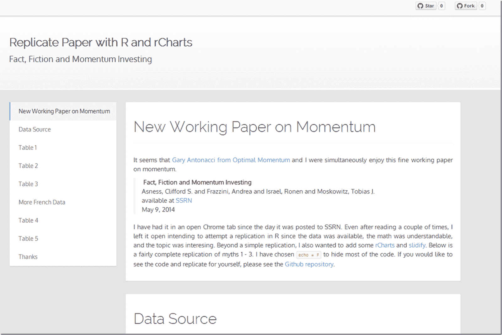

<!--yml
category: 未分类
date: 2024-05-18 14:53:19
-->

# Timely Portfolio: Dispelling Myths of Momentum | AQR Research Factory

> 来源：[http://timelyportfolio.blogspot.com/2014/06/dispelling-myths-of-momentum-aqr.html#0001-01-01](http://timelyportfolio.blogspot.com/2014/06/dispelling-myths-of-momentum-aqr.html#0001-01-01)

In a recent [working paper](http://papers.ssrn.com/sol3/papers.cfm?abstract_id=2435323) from the prolific [AQR](http://www.aqr.com/) Research Factory, the authors seek to dispel ten common myths of momentum investing.  To their credit, they use the fine data [publicly available](http://mba.tuck.dartmouth.edu/pages/faculty/ken.french/data_library.html) from Kenneth French and use fairly simple metrics to make compelling arguments against the myths and for the momentum factor.  I replicated most of the calculations in R, and then in a blend of replication, summary, and discussion on process, used [rCharts](http://rcharts.io), [Gmisc](http://gforge.se/gmisc/), and [slidify](http://slidify.io) to create the following [writeup](http://timelyportfolio.github.io/rCharts_factor_analytics/aqr_fact_fiction_momentum.html).  I hope others find it useful, and it serves a purpose much greater than a re-creation.

For another very detailed summary of the paper, see [the post from Gary Antonacci of Optimal Momentum](http://optimalmomentum.blogspot.com/2014/06/fact-fiction-and-momentum-investing.html).

To make sure this gets seen by those who might not read the paper, I will copy the thanks section below.

### Thanks specifically: