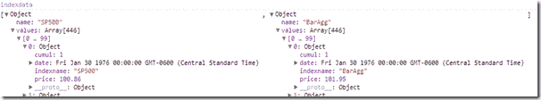

<!--yml
category: 未分类
date: 2024-05-18 15:01:09
-->

# Timely Portfolio: Doing Things the Hard Way with d3

> 来源：[http://timelyportfolio.blogspot.com/2013/03/doing-things-hard-way-with-d3.html#0001-01-01](http://timelyportfolio.blogspot.com/2013/03/doing-things-hard-way-with-d3.html#0001-01-01)

Although embarrassing, I thought this might help some folks learning [d3.js](http://d3js.org).  Most of my struggles with [d3.js](http://d3js.org) center around getting the data in proper form.  I think most of it is mindset.  d3.js offers a full range of helper functions to easily accomplish this task, but it seems my brain has been conditioned to think a different way.  In some ways, I liken it to my initial difficulty with [R’s](http://r-project.org) set of apply functions.  With a lot of practice, I think once you get it you get it.

Take for example a recent experiment with [zui53 and d3 on index data](http://bl.ocks.org/timelyportfolio/5149102).  I spent more than an hour coming up with this mess:

```
 ```
var indexkeys = d3.keys(d3.nest().key(function (d) { return d.indexname; }).map(data))
```

var indexdata = indexkeys
     .map(function (name) {
           return {
           name: name,
           values: data.filter(function (d) { return d.indexname == name; })
       };
 });
```

```
The original data is a csv in long format
```

```
date,indexname,price
1976-01-30,SP500,100.86
1976-02-27,SP500,99.71
...
2013-01-31,BarAgg,1831.49
2013-02-28,BarAgg,1840.67
```

```
which I would like to look like.
```

```

```

```
Although my ugly mess works, after a couple days away from the code, I had a thought after reading D3 Nest Tutorial and examples for a fifth time.  I could have just simply done this.
```

```
indexdata = d3.nest().key(function(d) {return d.indexname;}).entries(data)
```

I thought I had it all figured out after [https://groups.google.com/forum/?fromgroups=#!topic/d3-js/biALMQnYUgo](https://groups.google.com/forum/?fromgroups=#!topic/d3-js/biALMQnYUgo "https://groups.google.com/forum/?fromgroups=#!topic/d3-js/biALMQnYUgo"), but as you can see not even close.