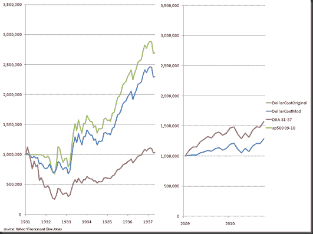

<!--yml
category: 未分类
date: 2024-05-18 15:24:27
-->

# Timely Portfolio: Dollar Cost Average in Ugly Markets Version 2

> 来源：[http://timelyportfolio.blogspot.com/2011/01/dollar-cost-average-in-ugly-markets.html#0001-01-01](http://timelyportfolio.blogspot.com/2011/01/dollar-cost-average-in-ugly-markets.html#0001-01-01)

As an update to my [“Dollar Cost Averaging in Ugly Markets” post from earlier today](http://timelyportfolio.blogspot.com/2011/01/dollar-cost-averaging-in-ugly-markets.html), I updated the system slightly.  In this version, buy after a 55% drawdown 10% each month that is higher than the previous month.  The results from 1931-1937 in the Dow and 2009-2010 in the S&P 500 are shown below. 

There are certainly far better systems and methods, and I do not advise this as your method of entry, but sometimes it is nice and comforting to keep it very simple in the midst of panic.

Of course, this all assumes that the investor exited in the first place at some point prior to the 55% drawdown.

 **1 hour**