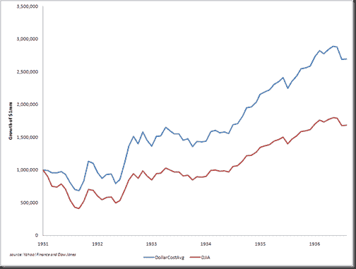

<!--yml
category: 未分类
date: 2024-05-18 15:24:35
-->

# Timely Portfolio: Dollar Cost Averaging in Ugly Markets

> 来源：[http://timelyportfolio.blogspot.com/2011/01/dollar-cost-averaging-in-ugly-markets.html#0001-01-01](http://timelyportfolio.blogspot.com/2011/01/dollar-cost-averaging-in-ugly-markets.html#0001-01-01)

[Pragmatic Capital’s summary](http://pragcap.com/deep-thoughts-by-jeff-saut) of [Jeff Saut’s weekly commentary](http://www.raymondjames.com/inv_strat.htm) reminded of my dollar-cost averaging notion that I had on (I’m not kidding) March 9, 2009 in an email:

> “Another thought I had:
> 
> What if you started investing 10%/month in Dow  for 10 months until 100% equity allocation  after you hit the 60% drawdown level in September 1931?  These are your returns pursuing such a strategy.  Good to know assuming this is the absolute worst case  (can't think of much worse than the Great Depression with 89% ultimate drawdown) .  I like my chances.”

The thought at that point was how can we overcome the panic/despair/despondency of the dreadful market in 2008 and take definitive action to transform ugliness into opportunity.  So, knowing in 2008, that the bottom was unknowable, I thought I could test dollar cost averaging on the worst market in US history and see how it might work.  I picked without optimization 60% as the drawdown level to initiate a 10 month (makes the math easier) 10%/month allocation to the Dow Jones (1929-1931) and S&P500 (2007-2008).  The 60% drawdown level on monthly average basis hit September 1931, so let’s see how it worked then.  Just knowing the worst case can help overcome the disabling fear.  A little tweaking would dramatically improve the performance, but I wanted to be intellectually honest and not optimize.

Unfortunately for the system but fortunately for the remaining equity investors, the S&P 500 did not hit 60% drawdown in the 2008 crisis.  Just for fun, let’s tie this post and system concept to the caution of my [“Perils of Bottom Picking” post](http://timelyportfolio.blogspot.com/2011/01/perils-of-bottom-picking.html) by amending the drawdown to 55% and only investing when the index moves up on a monthly basis in tomorrow’s post (have not done, so will be a surprise to me too)…

*75 minutes*