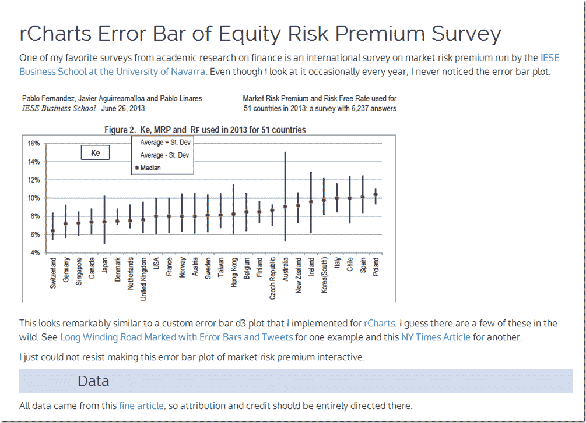

<!--yml
category: 未分类
date: 2024-05-18 14:56:29
-->

# Timely Portfolio: Equity Market Risk Premium Around the World

> 来源：[http://timelyportfolio.blogspot.com/2013/10/equity-market-risk-premium-around-world.html#0001-01-01](http://timelyportfolio.blogspot.com/2013/10/equity-market-risk-premium-around-world.html#0001-01-01)

Over the years I have really enjoyed this very thorough [IESE Business School](http://www.iese.edu/) survey of market risk premium around the world.

> **Market Risk Premium and Risk Free Rate Used for 51 Countries in 2013**
> A Survey with 6,237 Answers
> 
> Fernandez, Pablo and Aguirreamalloa, Javier and Linares, Pablo
> June 26, 2013
> Available at SSRN: [http://ssrn.com/abstract=91416](http://ssrn.com/abstract=91416)

I thought a little d3/rCharts interactivity might really liven up the error bar plot.  This is far from perfect, but I like the direction in which it is headed.  Click [here](http://timelyportfolio.github.io/rCharts_errorbar/marketriskpremium/mktRiskPremium.html) or on the screenshot below to see it live.

