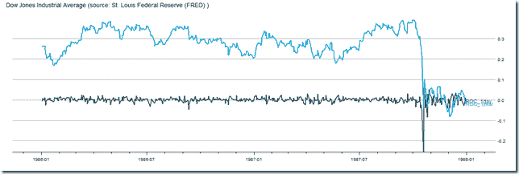

<!--yml
category: 未分类
date: 2024-05-18 14:54:18
-->

# Timely Portfolio: Find it Humorous … “Not So Bad” in the “long-term”

> 来源：[http://timelyportfolio.blogspot.com/2014/04/find-it-humorous-not-so-bad-in-long-term.html#0001-01-01](http://timelyportfolio.blogspot.com/2014/04/find-it-humorous-not-so-bad-in-long-term.html#0001-01-01)

I agree the market selloff has been weak thus far (especially as a frustrated bear).  However, I find it humorous as some widely followed commentators say things like “You’re only down x% ytd.  It’s not that bad”.  I wonder if this selloff gets worse will they extend to a 12 month horizon since last year was so good.  Immediately makes me think of 1987.

  **October 19, 1987** : Today was not so bad.  You are only down 3% ytd.

*Edit:  Ok, I just had to add an interactive version:*