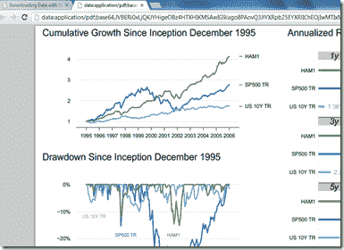

<!--yml
category: 未分类
date: 2024-05-18 15:02:16
-->

# Timely Portfolio: From d3 to pdf (hopefully knitr) with R Shiny

> 来源：[http://timelyportfolio.blogspot.com/2012/12/from-d3-to-pdf-hopefully-knitr-with-r.html#0001-01-01](http://timelyportfolio.blogspot.com/2012/12/from-d3-to-pdf-hopefully-knitr-with-r.html#0001-01-01)

Although I think I like the [d3](http://d3js.org/), R, and [Shiny](http://rstudio.com/shiny) team the best, I could definitely envision a big need for multi-page pdf reports created with R, [knitr](http://yihui.name/knitr/), and latex delivered to the browser with [Shiny](http://rstudio.com/shiny).  Shiny helpfully provides pre-built functionality to send .png charts and graphics created by R to the web.  This works especially well since most browsers offer containers for the graphics that can dynamically change.

In this quick experiment, I use the pdf() dev function from R instead of the hoped for knit2pdf to see if sending the binary pdf data is possible.  ~~It seems the downloadHandler function from Shiny only currently handles text.~~  The downloadHandler function from Shiny also serves up downloads well.  I have included the code to get that to work also if you prefer this behavior.

Try it out at [http://glimmer.rstudio.com/timelyportfolio/shiny-d3-pdf](http://glimmer.rstudio.com/timelyportfolio/shiny-d3-pdf).  It seems to work with the newest Chrome and IE.

Code at [Github](http://github.com/timelyportfolio/shiny-d3-pdf).