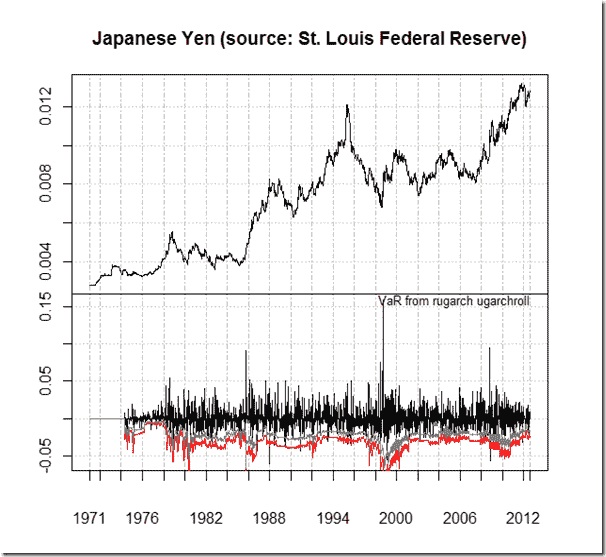

<!--yml
category: 未分类
date: 2024-05-18 15:04:07
-->

# Timely Portfolio: GARCH Panel in plot.xts

> 来源：[http://timelyportfolio.blogspot.com/2012/08/garch-panel-in-plotxts.html#0001-01-01](http://timelyportfolio.blogspot.com/2012/08/garch-panel-in-plotxts.html#0001-01-01)

I’m clearly out of my realm of competence with most of the rugarch functions, but I thought it might be nice to provide an example combining plot.xts and uGARCHroll.

[R code from GIST:](https://gist.github.com/3382974)