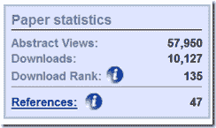
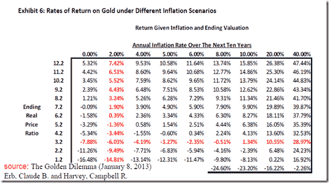
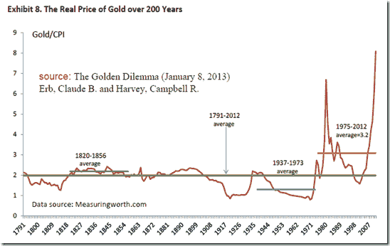
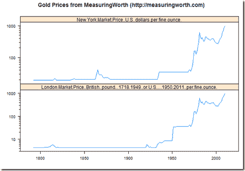

<!--yml
category: 未分类
date: 2024-05-18 15:01:01
-->

# Timely Portfolio: How Did I Miss “The Golden Dilemma”?

> 来源：[http://timelyportfolio.blogspot.com/2013/03/how-did-i-miss-golden-dilemma.html#0001-01-01](http://timelyportfolio.blogspot.com/2013/03/how-did-i-miss-golden-dilemma.html#0001-01-01)

I am ashamed to admit that I am way behind (about 10,127 downloads) in discovering this wonderful paper:

> **The Golden Dilemma** (January 8, 2013)
> Erb, Claude B. and Harvey, Campbell R.
> Available at SSRN: [http://ssrn.com/abstract=2078535](http://ssrn.com/abstract=2078535)
> 
> 

Here are the authors presenting the concept in July 2012 if you prefer slideshow format (thanks [http://abnormalreturns.com/saturday-links-the-gold-dilemma/](http://abnormalreturns.com/saturday-links-the-gold-dilemma/ "http://abnormalreturns.com/saturday-links-the-gold-dilemma/")).

> A presentation on “The Gold Dilemma” by **Claude Erb** and **Campbell Harvey**. ([*Duke*](http://faculty.fuqua.duke.edu/~charvey/Gold.pdf))

I have struggled with the various reasons I have heard for owning gold, which often conflict with each other, and how gold cannot universally work in all environments.  The authors enumerate and explore 6 arguments for owning gold:

1.  “gold provides an inflation hedge”
2.  “gold serves as a currency hedge”
3.  “gold is an attractive alternative to assets with low real returns”
4.  “gold a safe haven in times of stress”
5.  “gold should be held because we are returning to a de facto world gold standard”
6.  “gold is underowned”

In previous posts from 2010 and 2011, I focused on the gold as a very expensive inflation hedge, but I was nowhere near as exhaustive as the authors on this point and did not even touch on the five others.

I very much liked Exhibit 6 from the paper outlining scenarios based on varying 10 year forward inflation and a gold/CPI constant (3.2 average since 1975 and 7.1 as March 2012).

Although the gold/CPI ratio averaged 3.2 1975-2012, the authors extend the analysis to 1791 using the very fine data gathered at [MeasuringWorth](http://measuringworth.com/) (more later in the post on importing this data to R for the R geeks).  The gold/CPI ratio has averaged 2 since 1791, which is clearly much lower than the almost current 8.  Using the table above would suggest a negative nominal return unless annualized inflation exceeds 15% for the next ten years.  Just think what happens to other markets in this environment, and gold might not even be the worse.

I was also delighted to see the authors reflect my concern that argument 2 could easily be the same as argument 1 in a debasement environment.

> “A second way to interpret the “gold as a currency hedge” argument sees “gold as a hedge of my own currency, spent in my own country, when the local government is printing money with abandon”. This is also sometimes referred to as “currency debasement”. If this debasement is a result of inflation, then this interpretation is just another version of the “gold as an inflation hedge” argument.”

I highly recommend readers work through the other arguments with the authors by reading the original paper, but (spoiler alert) if you do not want to do that, I think the conclusion very simply is that after a mammoth increase in gold prices, **none of the 6 arguments** can justify the current price.  The “gold is underowned” argument is the strongest but even then requires a unique marginal buyer “[who] are not focused on ‘valuation’.”  Of course, we do have a lot of central bank buyers now of every financial asset “not focused on ‘valuation’.”

Now almost for the [R](http://r-project.org) as promised, but first the data at [MeasuringWorth](http://measuringworth.com/) is truly special, and I would liken it to the other unbelievably generous set of financial data at [http://mba.tuck.dartmouth.edu/pages/faculty/ken.french/data_library.html](http://mba.tuck.dartmouth.edu/pages/faculty/ken.french/data_library.html "http://mba.tuck.dartmouth.edu/pages/faculty/ken.french/data_library.html").  Although no one has asked that I do this, please consider making a donation at [http://www.measuringworth.com/contribute.php](http://www.measuringworth.com/contribute.php "http://www.measuringworth.com/contribute.php") to insure the continuation of this data and hopefully maybe the collection of more.  Non-US financial data prior to 1900 is nearly impossible to find.

[MeasuringWorth](http://www.measuringworth.com/) data is extremely easy to access in R. As a simple example, I wanted to pull in the price of gold since the 1700s.  I did it in 2 lines of R.  In 5 I got this graph.

 

[R code from GIST:](https://gist.github.com/timelyportfolio/5172363)