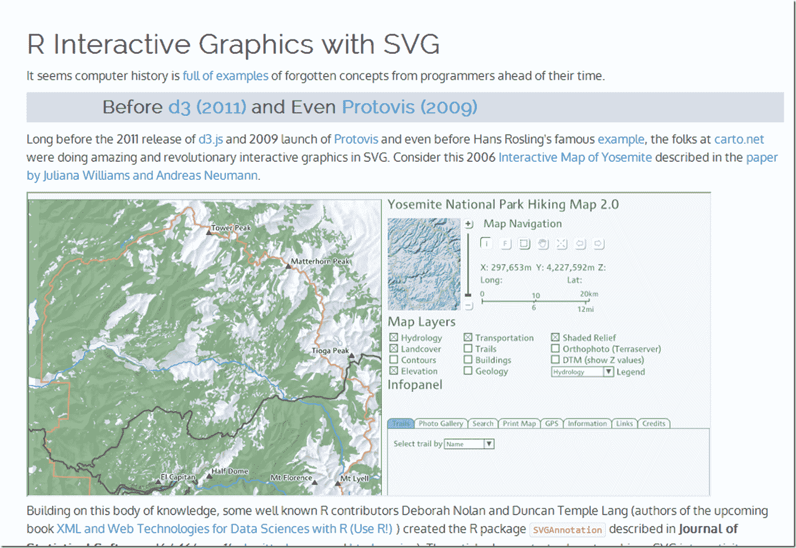

<!--yml
category: 未分类
date: 2024-05-18 14:58:39
-->

# Timely Portfolio: I Want ggplot2/lattice and d3 (gridSVG–The Glue)

> 来源：[http://timelyportfolio.blogspot.com/2013/08/gridsvganother-glue-for-r-to-svg.html#0001-01-01](http://timelyportfolio.blogspot.com/2013/08/gridsvganother-glue-for-r-to-svg.html#0001-01-01)

I really like interactive graphics, especially when they come straight from R.  I posted a lot about [rCharts](http://rcharts.io/site), but it is not the only way.  In my mind there are three types of glue to link R to SVG/HTML/Javascript:

1.  Let R do the data and then send the data to Javascript to create the SVG graphics. This is the process employed by [rCharts](http://rcharts.io/site), [clickme](http://rclickme.com/),[d3network](http://christophergandrud.github.io/d3Network/), [googleVis](http://cran.r-project.org/web/packages/googleVis/index.html), [gigvis](https://github.com/rstudio/gigvis), and [tabplotd3](http://cran.r-project.org/web/packages/tabplotd3/index.html).

2.  Let R both do the data and render the graph then export the SVG to get interactivity from Javascript. We see this with the new and improved [gridSVG](http://sjp.co.nz/projects/gridsvg/) and the predecessor [SVGAnnotation](http://www.omegahat.org/SVGAnnotation/SVGAnnotationPaper/SVGAnnotationPaper.html#bib:SVGAnnotation).

3.  Use 1\. or 2\. and then maintain bidirectional communication between R and Javascript through [shiny](http://rstudio.com/shiny), [Rook](http://cran.r-project.org/web/packages/Rook/index.html), or some other web server type interface.

Let’s think about method 2.  R has ggplot2 and lattice.  Javascript has d3.  I want both.

We R users are very spoiled by the ggplot2 and lattice engines that rival or beat the plotting libraries of any language.  Wouldn’t it be nice to have all the power of these engines to create interactive graphs?  Well, [Paul Murrell](https://www.stat.auckland.ac.nz/~paul/), the author of grid (platform of ggplot2 and lattice), wrote [gridSVG](http://sjp.co.nz/projects/gridsvg/) to do just that.  Over the last couple of years, [Simon Potter](http://sjp.co.nz/projects/gridsvg/) under the guidance of Murrell has refined gridSVG for his honours project.  It is now a full-featured robust package capable of sending even your most complicated ggplot2 and lattice masterpieces to SVG.   gridSVG can do amazing things on his own, but I, of course, wanted to combine gridSVG with [d3](http://d3js.org).  Click [here](http://timelyportfolio.github.io/gridSVG_intro) or on the screenshot below to see a walkthrough applying a little gridSVG glue to ggplot2 and d3\.

Thanks to Paul Murrell, Simon Potter, Hadley Wickham, Mike Bostock, Duncan Temple Lang, Deborah Nolan, Juliana Williams, Andreas Neumann, Ramnath Vaidyanathan and all the folks along the way that have made this possible.