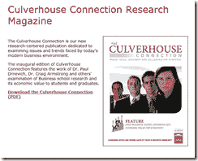

<!--yml
category: 未分类
date: 2024-05-18 15:06:39
-->

# Timely Portfolio: In Tuscaloosa Today

> 来源：[http://timelyportfolio.blogspot.com/2012/05/in-tuscaloosa-today.html#0001-01-01](http://timelyportfolio.blogspot.com/2012/05/in-tuscaloosa-today.html#0001-01-01)

Any readers in Tuscaloosa?  I would love to meet up.

As a side note, I was delighted to find a summary of all the fine research being done at the University of Alabama.  I look forward to reading some of the papers, and hopefully benefitting from the research:

> “In the study, published in the
> December-February issue of Academy
> of Management Learning and Education,
> the authors found that scholarly
> research at business schools appears
> to add as much as 21 percent to the
> MBA students’ future salaries, or about
> $24,000 a year. The paper is titled
> “Does Business School research add
> Economic Value for Students?”

