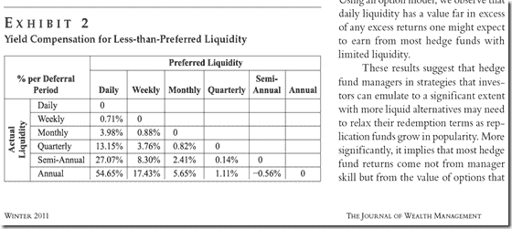
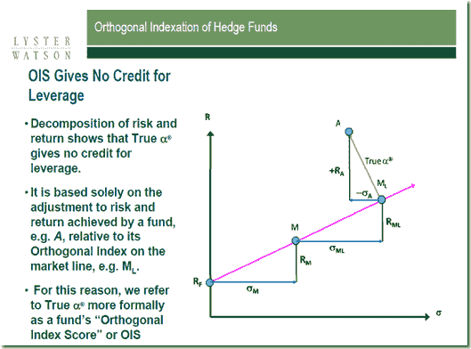

<!--yml
category: 未分类
date: 2024-05-18 15:01:56
-->

# Timely Portfolio: Interesting Presentation from Van Eck Trackers Team

> 来源：[http://timelyportfolio.blogspot.com/2013/01/interesting-presentation-from-van-eck.html#0001-01-01](http://timelyportfolio.blogspot.com/2013/01/interesting-presentation-from-van-eck.html#0001-01-01)

I just saw a very interesting presentation from the Van Eck Trackers Team ([acquired by Van Eck in July 2012](http://www.opalesque.com/industry-updates/2701/after-acquiring-hedge-fund-beta-business-and-team.html)) at the [CFA Society of Alabama](www.cfasociety.org/alabama) January 2013 lunch.  I have not had the chance to read all their research and attempt to replicate portions in R, but I found two points very compelling.  First, the research done on the price of illiquidity

> [Freed, Marc S., and Ben McMillan. "Investible Benchmarks and Hedge Fund Liquidity." The Journal of Wealth Management 14.3: 58-66.](http://www.iinews.com/site/pdfs/JWM_Winter2011_LysterWatson.pdf)

published in the **[Journal of Wealth Management](http://www.iinews.com/site/pdfs/JWM_Winter2011_LysterWatson.pdf)** potentially could inversely answer the pricing of Warren Buffett’s notion of “cash as a call option” described in a [Globe and Mail article](http://www.theglobeandmail.com/globe-investor/investment-ideas/streetwise/for-warren-buffett-the-cash-option-is-priceless/article4565468/) with [my own thoughts in this post](http://timelyportfolio.blogspot.com/2012/11/cashopportunity-lost-or-opportunity.html).  The price of illiquidity can be considerable as shown below,

so inversely the opportunity from liquidity or available cash could be substantial. Imagine what hedge fund performance might look like net of fee, net of tax, and net of illiquidity. Even the best managers cannot achieve a high enough return to compensate for this level of embedded costs.  Strangely enough it also comes close to my crude heuristic of 10% expected return premium necessary for me to justify illiquidity.

The presentation ([similar presentation given to the CFA Society of Pittsburgh](http://www.cfasociety.org/pittsburgh/Linked%20Files/Dec_11_LW%20Investible%20Benchmarks%20and%20Hedge%20Fund%20Liquidity%20pdf.pdf)) also discusses the concept of True® Alpha.  The decomposition is nicely described in this graphic from the presentation.

 

I have not confirmed with the authors/speakers their use of R, but their were some remarkably familiar graph layouts that lead me to believe R played a prominent role.  Regardless, I would really like to replicate some of the calculations in R.