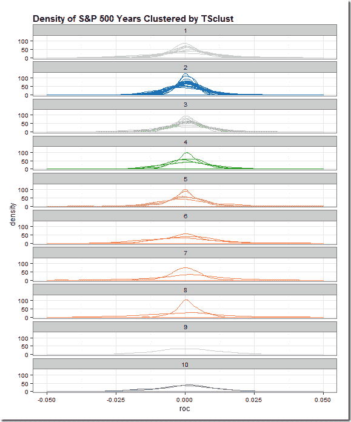
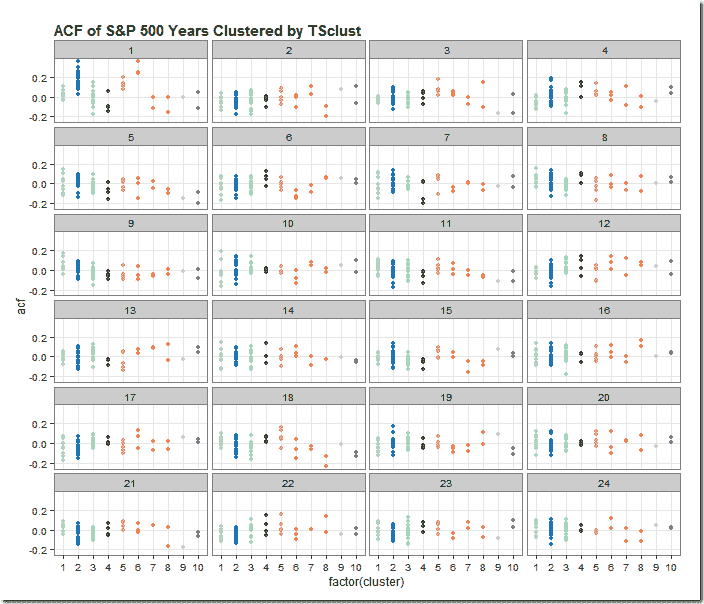

<!--yml
category: 未分类
date: 2024-05-18 14:49:53
-->

# Timely Portfolio: Is Time Series Clustering Meaningless? (lots of dplyr)

> 来源：[http://timelyportfolio.blogspot.com/2015/03/is-time-series-clustering-meaningless.html#0001-01-01](http://timelyportfolio.blogspot.com/2015/03/is-time-series-clustering-meaningless.html#0001-01-01)

A kind reader directed me in a comment on [Experiments in Time Series Clustering](http://timelyportfolio.blogspot.com/2015/03/experiments-in-time-series-clustering.html) to this paper.

> Clustering of Time Series Subsequences is Meaningless: Implications for Previous and Future Research
> 
> Eamonn Keogh  and Jessica Lin
> 
> Computer Science & Engineering Department University of California – Riverside
> 
> [http://www.cs.ucr.edu/~eamonn/meaningless.pdf](http://www.cs.ucr.edu/~eamonn/meaningless.pdf "http://www.cs.ucr.edu/~eamonn/meaningless.pdf")

As I said in my last post, I don’t know what I’m doing, so I have no basis for discussing or arguing time series clustering.  After reading the paper a couple of times, I think I understand their points, and I do not think what I am doing is “meaningless”.  In their financial time series examples, they use prices and speak of trying to find patterns.  I simply want to classify which years are most alike by various characteristics, such as autocorrelation of **returns**  not prices, distribution of returns, and all sorts of other classifiers.

More than anything this whole exercise gave me a good excuse to dig much, much deeper.  Iongtime readers might be wondering where are the interactive plots.  I wanted to share what I have done so far hoping that readers might elaborate, argue, or point me in good directions.

Regardless of your interest in time series clustering, you might enjoy the dplyr and piping that I used to generate the results.  Also, I have not seen dplyr `do` applied to autocorrelation `ACF`, so you might want to check that out in the last snippet of code.

All of the code for this post and last post is in this [Github repo](https://github.com/timelyportfolio/TSclust_experiments).

[](https://blogger.googleusercontent.com/img/b/R29vZ2xl/AVvXsEgwSif_WWnYlk1HqSxfwAaJJnkzxav7_p-JTi4ySlMmCa3lJN1CpIGHA6Go2MRcNI49NiyHTuU6HbtnEzGzP-YNCE1CMey_0YoGVKzjidXGBIyH1qeix4J188wvUWgbA2XHMBWAxO1Myg/s1600-h/image%25255B3%25255D.png)

```
 library(TSclust)
library(quantmod)
library(dplyr)
library(pipeR)
library(tidyr)

sp5 <- getSymbols("^GSPC",auto.assign=F,from="1900-01-01")[,4]

sp5 %>>%
  # dplyr doesn't like xts, so make a data.frame
  (
    data.frame(
      date = index(.)
      ,price = .[,1,drop=T]
    )
  ) %>>%
  # add a column for Year
  mutate( year = as.numeric(format(date,"%Y"))) %>>%
  # group by our new Year column
  group_by( year ) %>>%
  # within each year, find what day in the year so we can join
  mutate( pos = rank(date) ) %>>%
  mutate( roc = price/lag(price,k=1) - 1 ) %>>%
  # can remove date
  select( -c(date,price) ) %>>%
  as.data.frame %>>%
  # years as columns as pos as row
  spread( year, roc ) %>>%
  # remove last year since assume not complete
  ( .[,-ncol(.)] ) %>>%
  # remove pos since index will be same
  select( -pos ) %>>%
  # fill nas with previous value
  na.fill( 0 ) %>>%
  t %>>%
(~sp_wide) %>>%
  # use TSclust diss; notes lots of METHOD options
  diss( METHOD="ACF" ) %>>%
  hclust %>>%
(~hc) %>>%
  ape::as.phylo() %>>% 
  treewidget #%>>%
  #htmlwidgets::as.iframe(file="index.html",selfcontained=F,libdir = "./lib")

library(lattice)
library(ggplot2)
# get wide to long the hard way
#  could have easily changed to above pipe to save long
#  as an intermediate step
#  but this makes for a fun lapply
#  and also we can add in our cluster here
sp_wide %>>%
  (
    lapply(
      rownames(.)
      ,function(yr){
        data.frame(
          year = as.Date(paste0(yr,"-01-01"),"%Y-%m-%d")
          ,cluster = cutree(hc,10)[yr]
          ,pos = 1:length(.[yr,])
          ,roc = .[yr,]
        )
      }
    )
  ) %>>%
  (do.call(rbind,.)) %>>%
(~sp_long)

sp_long %>>%
  ggplot( aes( x = roc, group = year, color = factor(cluster) ) ) %>>%
  + geom_density() %>>%
  + facet_wrap(  ~ cluster, ncol = 1 ) %>>%
  + xlim(-0.05,0.05) %>>%
  + labs(title='Density of S&P 500 Years Clustered by TSclust') %>>%
  + theme_bw() %>>%
  # thanks to my friend Zev Ross for his cheatsheet
  + theme( plot.title = element_text(size=15, face="bold", hjust=0) ) %>>%
  + theme( legend.position="none" )  %>>%
  + scale_color_brewer( palette="Paired" ) 
```

[](https://blogger.googleusercontent.com/img/b/R29vZ2xl/AVvXsEgPhHFGdmddjO-yr2TvxVACQP1u03lH-NIWXF0ZQ6dx0qXxSNNCWCZYocEv1a0J1cMBq3ez-sme5pUutT-JFWB_E06WHP71p-71ULETsOCsIRNJf5JOFkVOb-2lKwsTTQ5PQQfp2-2_qg/s1600-h/acf_plot%25255B3%25255D.png)

```
 # explore autocorrelations
sp5 %>>%
  # dplyr doesn't like xts, so make a data.frame
  (
    data.frame(
      date = index(.)
      ,price = .[,1,drop=T]
    )
  ) %>>%
  # add a column for Year
  mutate( year = as.numeric(format(date,"%Y"))) %>>%
  # group by our new Year column
  group_by( year ) %>>%
  # within each year, find what day in the year so we can join
  mutate( pos = rank(date) ) %>>%
  mutate( roc = price/lag(price,k=1) - 1 ) %>>%
  # can remove date
  select( -c(date,price) ) %>>%
  as.data.frame %>>%
  # years as columns as pos as row
  spread( year, roc ) %>>%
  # remove last year since assume not complete
  ( .[,-ncol(.)] ) %>>% t -> sP

sp_long %>>%
  group_by( cluster, year ) %>>%
  do(
    . %>>%
    (
      clustd ~ 
      acf(clustd$roc,plot=F) %>>%
        (a ~
          data.frame(
            cluster = clustd[1,2]
            ,year = clustd[1,1]
            ,lag = a$lag[-1]
            ,acf = a$acf[-1]
          )
        )
    )
  ) %>>%
  as.data.frame %>>%
  ggplot( aes( x = factor(cluster), y = acf, color = factor(cluster) ) ) %>>%
    + geom_point() %>>%
    + facet_wrap( ~lag, ncol = 4 ) %>>%
    + labs(title='ACF of S&P 500 Years Clustered by TSclust') %>>%
    + theme_bw() %>>%
    # thanks to my friend Zev Ross for his cheatsheet
    + theme(
        plot.title = element_text(size=15, face="bold", hjust=0)
        ,legend.title=element_blank()
    ) %>>%
    + theme(legend.position="none")  %>>%
    + scale_color_brewer(palette="Paired") 
```

If you’ve made it this far, I would love to hear from you.