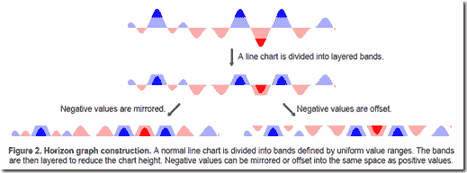

<!--yml
category: 未分类
date: 2024-05-18 15:04:57
-->

# Timely Portfolio: More on Horizon Charts

> 来源：[http://timelyportfolio.blogspot.com/2012/08/more-on-horizon-charts.html#0001-01-01](http://timelyportfolio.blogspot.com/2012/08/more-on-horizon-charts.html#0001-01-01)

*for background please see prior posts [Application of Horizon Plots](http://timelyportfolio.blogspot.com/2012/07/application-of-horizon-plots.html),* [*Horizon Plot Already Available*](http://timelyportfolio.blogspot.com/2012/06/horizon-plot-already-available.html), *and* [*Cubism Horizon Charts in R*](http://timelyportfolio.blogspot.com/2012/06/cubism-horizon-charts-in-r.html)

Some feedback has led me to think that I might have been a little ambitious with [my last post on horizon charts](http://timelyportfolio.blogspot.com/2012/07/application-of-horizon-plots.html). I thought it might be helpful to quickly provide an overview on horizon charts. Since I am not a visualization expert, I will try to compile the best examples and tutorials that I have found. At the end, I will do a step by step walkthrough of the construction of a horizon chart in R.

Below is a great talk in its entirety by Mike Bostock.  For the discussion on horizon charts, skip to the 11:20 mark.

[Mike Bostock @ Square talks about Time Series Visualization](http://vimeo.com/42176902) from [Librato](http://vimeo.com/librato) on [Vimeo](http://vimeo.com).

Fortunately, Mike also provides the interactive example from the video demonstrating the construction of a horizon chart from an area chart.  I have embedded it below (see [https://bl.ocks.org/1483226](https://gist.github.com/1483226 "https://gist.github.com/1483226") for the full example from the original source).

This quick YouTube clip from Panopticon all the way back in 2009 also does a very nice job explaining construction.  If you learn better from reading, a [short paper from Hannes Reijner of Panopticon Software](http://www.stonesc.com/Vis08_Workshop/DVD/Reijner_submission.pdf) covers the same material.

[http://www.youtube.com/embed/M53dYUcQbCs](http://www.youtube.com/embed/M53dYUcQbCs)

VIDEO

Jeffrey Heer of Stanford University with Nicholas Kong and Maneesh Agrawala from University of California, Berkeley, [investigate the effectiveness of horizon plots and make some recommendations for their use.](http://vis.stanford.edu/files/2009-TimeSeries-CHI.pdf)  The chart below also offers another explanation of the steps in building a horizon plot.

They recommend and conclude

> **Layered Bands Are Beneficial As Chart Size Decreases**
> We found that dividing a chart into layered bands reliably increased estimation time and increased estimation error at constant chart heights. However, we also found that 2-band mirrored charts led to better estimation accuracies for chart heights less than 24 pixels (6.8 mm on our displays). For larger chart sizes, we advise scaling 1-band mirrored charts.  For smaller sizes, we advise adding layered bands.

Extending the horizon into healthcare, here is an interesting [project using horizon graphs for visualization of diabetes care](http://ieg.ifs.tuwien.ac.at/projects/HorizonVis/).

> ### HorizonVis
> 
> #### Interactive Visual Exploration of Multivariate Medical Measurements in Diabetes Care
> 
> 
> 
> Lead / Contact
> [Wolfgang Aigner](http://ieg.ifs.tuwien.ac.at/%7Eaigner/)
> 
> Team
> [Wolfgang Aigner](http://ieg.ifs.tuwien.ac.at/%7Eaigner/), Vienna University of Technology
> Michael Atanasov, HTBL Krems
> [Alexander Rind](http://www.ifs.tuwien.ac.at/%7Erind/), Vienna University of Technology
> Philipp Schindler, HTBL Krems
> Reinhardt Wenzina, HTBL Krems
> 
> Partners
> [Vienna University of Technology, Institute of Software Technology & Interactive Systems](http://ieg.ifs.tuwien.ac.at/)
> [HTBL Krems, Department of Information Technology](http://www.htlkrems.ac.at/)

**Now For My Own Attempt at Explaining**

If we use yesterday’s example of a 200 day moving average system where you enter when above the moving average and exit when below, we might like to see a standard time series plot like this one.

In a simple world with only one asset or stock, this might be sufficient.  However, we probably will have multiple instruments that we would like to monitor, and dedicating this much height per instrument will require lots of space.  Ideally, we could condense each of these plots, so that we could see many at a time.

In the first step toward condensing, we could extract just the information that is most meaningful, which I consider to be the percent above or below the moving average.

We might then try an area chart to better depict above or below 0.

I’m sure you are wondering though when we will start reducing height and saving space.  We could start by changing all the negative values to positive values, and add color to represent positive or negative.  This means we cut our chart height by about 1/2.

However, we need much more efficiency, so let’s separate the chart into bands.

Is there any potential way of separating each of these bands and then recombining them to save space?  Let’s look at each band separately.

Band 1 (0 to 10%)

Band 2 (10% to 20%)

Band 3 (20% to 30%)

Band 4 (30% to 40%) exceeding 3 bands is not recommended

Notice that similar to a heat map, the band colors increase in intensity and opaqueness as their values increase. If we layer each band on top of each other, we get a horizon plot, and we can reduce the original chart by 1/6 or even more without significant loss of information.

I hope this helps explain why we might use horizon plots and how to make them.  If nothing else, maybe you will have learned some lattice techniques in R.

[R code in GIST (do raw for copy/paste):](https://gist.github.com/3230354)