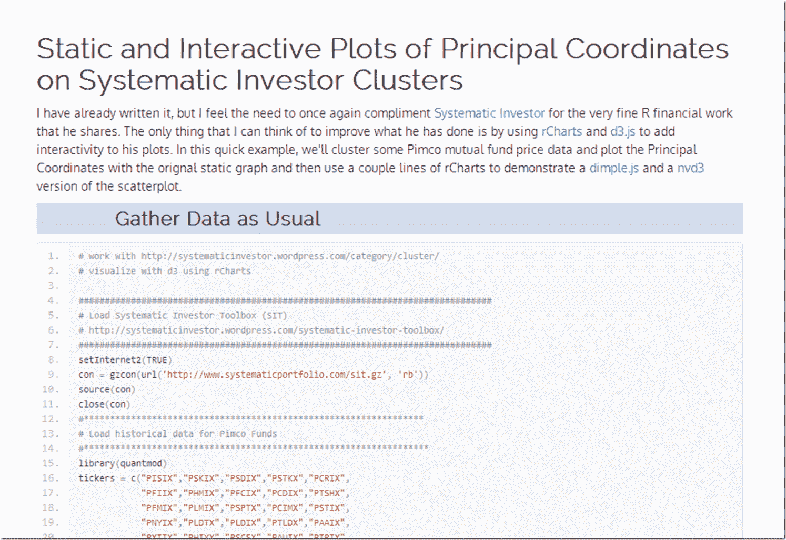

<!--yml
category: 未分类
date: 2024-05-18 14:57:26
-->

# Timely Portfolio: Ode to Systematic Clusters

> 来源：[http://timelyportfolio.blogspot.com/2013/09/ode-to-systematic-clusters.html#0001-01-01](http://timelyportfolio.blogspot.com/2013/09/ode-to-systematic-clusters.html#0001-01-01)

Extending the [d3 remixes](http://timelyportfolio.blogspot.com/search/label/systematic%20investor) of the fine work at [Systematic Investor](http://systematicinvestor.wordpress.com), I thought it woud be fun to do some [dimple.js](http://dimplejs.org) and [nvd3](http://nvd3.org) scatterplots of clusters of PIMCO mutual funds.  As always, I welcome thoughts, comments, and suggestions.  Click [here](http://timelyportfolio.github.io/rCharts_systematic_cluster/pimco_pcplots.html) or on the screenshot below.

