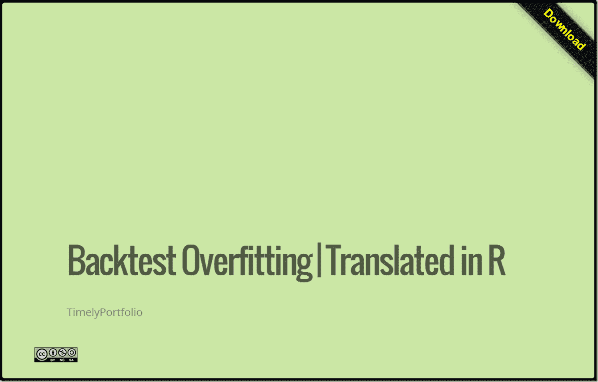

<!--yml
category: 未分类
date: 2024-05-18 14:56:47
-->

# Timely Portfolio: Overfitted Backtests

> 来源：[http://timelyportfolio.blogspot.com/2013/10/overfitted-backtests.html#0001-01-01](http://timelyportfolio.blogspot.com/2013/10/overfitted-backtests.html#0001-01-01)

It has been a [while](http://timelyportfolio.blogspot.com/2011/10/ttrtests-4th-and-final-test.html) since I discussed testing for overfitting in backtests.  Since then, [Marcos López de Prado](http://www.quantresearch.info/index.html) and [coauthors](http://www.quantresearch.info/Co-authors.htm) have done some very [thoughtful work](http://www.quantresearch.info/Publications.htm) (see the bottom), and they even started a [blog](http://www.financial-math.org/blog/).  Their newest paper builds on discoveries they made in their earlier work, and is an absolute must-read.

> [Bailey, David H.](http://papers.ssrn.com/sol3/cf_dev/AbsByAuth.cfm?per_id=1787856) and [Borwein, Jonathan M.](http://papers.ssrn.com/sol3/cf_dev/AbsByAuth.cfm?per_id=2117800) and [Lopez de Prado, Marcos](http://papers.ssrn.com/sol3/cf_dev/AbsByAuth.cfm?per_id=434076) and [Zhu, Qiji Jim](http://papers.ssrn.com/sol3/cf_dev/AbsByAuth.cfm?per_id=779856)
> 
> **Pseudo-Mathematics and Financial Charlatanism: The Effects of Backtest Overfitting on Out-of-Sample Performance** (October 7, 2013)
> 
> Available at SSRN: [http://ssrn.com/abstract=2308659](http://ssrn.com/abstract=2308659)

Translating scientific papers into code is not always easy, but I spent some time implementing some of the concepts in R, so that I can understand this more fully.  Just as a word of encouragement to others out there, I am no math genius nor have any advanced math education, so please don’t be intimidated by formulas.  Below you will see a [slidify/rCharts discussion](http://timelyportfolio.github.io/research_lopezdePrado) demonstrating these first steps.  I plan to research this much more thoroughly.  As always, I blog to interact, so please let me know what you are thinking.

