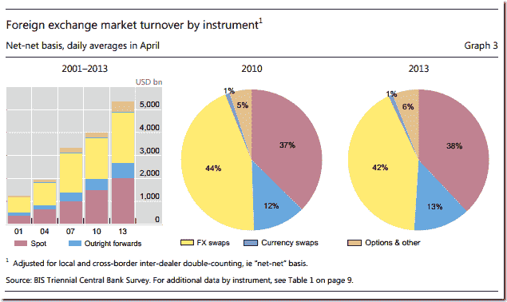

<!--yml
category: 未分类
date: 2024-05-18 14:53:36
-->

# Timely Portfolio: PDF Chart–> Inkscape SVG –> d3 Interactive Chart

> 来源：[http://timelyportfolio.blogspot.com/2014/05/pdf-chart-inkscape-svg-d3-interactive.html#0001-01-01](http://timelyportfolio.blogspot.com/2014/05/pdf-chart-inkscape-svg-d3-interactive.html#0001-01-01)

I just spent the last couple of days updating myself on the newest research on currency management.  For the best real-time (delayed about a year) broad look, BIS puts out an incredibly helpful [Triennial Central Bank Survey of foreign exchange...](http://www.bis.org/publ/rpfx13.htm "http://www.bis.org/publ/rpfx13.htm") in which you see things like this

and this.

pdfs suffer from a lack of interactivity, so I thought why not use [Inkscape’s](http://inkscape.org) PDF to SVG conversion to strip the above chart and make it SVG.  Then, if everything goes well, experiment with some basic interactivity provided by [d3.js](http://d3js.org).  Here is what happened.

If anyone would like a more extensive write up of the process, please let me know.