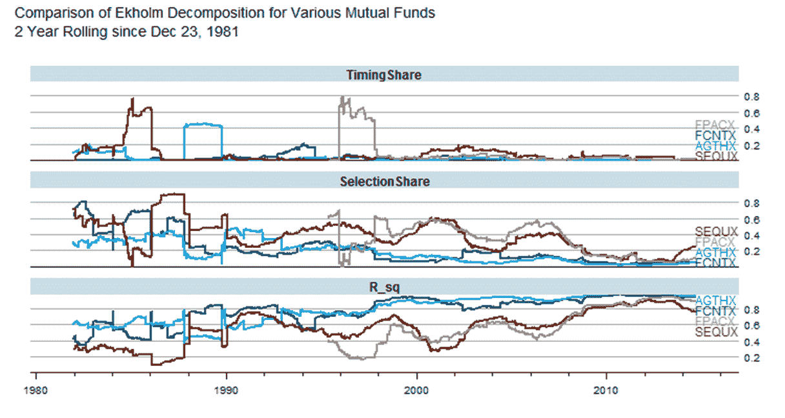

<!--yml
category: 未分类
date: 2024-05-18 14:51:37
-->

# Timely Portfolio: Popular Mutual Funds Decomposed With Ekholm (2014)

> 来源：[http://timelyportfolio.blogspot.com/2014/10/popular-mutual-funds-decomposed-with.html#0001-01-01](http://timelyportfolio.blogspot.com/2014/10/popular-mutual-funds-decomposed-with.html#0001-01-01)

While we have a foundation and momentum from the last post “[SelectionShare & TimingShare | Masterfully Written by Delightfully Responsive Author](http://timelyportfolio.blogspot.com/2014/10/selectionshare-timingshare-masterfully.html)” , we can run the Ekholm calculations on some popular funds to see how they have evolved since the early 1980s.  **Remember these are my opinions and not investment advice.** I chose these four funds for

1.  popularity in terms of Assets Under Management (AUM)
2.  style (active)
3.  tenure (old)
4.  evolution ( 2 evolved in a bad way and 2 have stayed consistent in a good way ).

This will continue what I envision to be a whole series of posts experimenting with the [Ekholm (2014)](http://ssrn.com/abstract=2463649) decomposition into SelectionShare and TimingShare and determining how to use it in a mutual fund selection process.  Just as a reminder, below is the link to the very well-done paper by [Anders Ekholm](http://www.andersekholm.fi/).

> Ekholm, Anders G.
> 
> Components of Portfolio Variance: Systematic, Selection and Timing
> 
> August 8, 2014
> 
> [http://ssrn.com/abstract=2463649](http://ssrn.com/abstract=2463649)

See if you can make any conclusions after reading the paper and looking at the chart below on the 2 year rolling Ekholm decomposition of [*FPA Crescent ®  Fund*](www.fpafunds.com/crescent) (FPACX), [*Sequoia ® Fund*](http://www.sequoiafund.com) (SEQUX), *[Fidelity ® Contrafund ®](https://fundresearch.fidelity.com/mutual-funds/summary/316071109)* (FCNTX), and [*The Growth Fund of America ®*](https://www.americanfunds.com/funds/details/gfa/a.html)   (AGTHX).

[](https://blogger.googleusercontent.com/img/b/R29vZ2xl/AVvXsEhrTUEGcMMY2pYyVg2NW-fGfRJQ8AVOCN6n5nRPw9uQ5UHgkHXq8W-I2dqVubY6SjOTMqpwGaXiVrH03G89molzEH7IR4rfU0mdHkQzq_HvMnhP_FbUQaZIHFHQZ80X_4OocjuEQK7cBA/s1600-h/image%25255B4%25255D.png)

As always, I really would like for you to reproduce and extend.  Please let me know if you do.  Below is the code.

```
# perform Ekholm (2012,2014) analysis on some popular mutual funds

# Ekholm, A.G., 2012
# Portfolio returns and manager activity:
#    How to decompose tracking error into security selection and market timing
# Journal of Empirical Finance, Volume 19, pp 349-€“358

# Ekholm, Anders G., July 21, 2014
# Components of Portfolio Variance:
#    R2, SelectionShare and TimingShare
# Available at SSRN: http://ssrn.com/abstract=2463649

library(Quandl)  # use to get Fama/French factors
library(pipeR)   # pipes are the future or R
library(rlist)   # rlist - like underscore/lodash for R lists
library(dplyr)   # super fast and really powerful
library(tidyr)   # next gen wide/long formatter package
library(latticeExtra) # old but still awesome
library(directlabels) # fantastic and works with ggplot & lattice
library(quantmod) # also will load xts

# use Quandl Kenneth French Fama/French factors
# http://www.quandl.com/KFRENCH/FACTORS_D
f <- Quandl("KFRENCH/FACTORS_D",type = "xts") / 100

# grab our function from post
# http://timelyportfolio.blogspot.com/2014/10/selectionshare-timingshare-masterfully.html
devtools::source_gist("e5728c8c7fb45dbdb6e0")

tickers <- c( "FCNTX", "AGTHX", "SEQUX", "FPACX" )
ekFunds <-  lapply(
  tickers
  ,function(ticker) {
    ticker %>>%
      getSymbols( from = "1896-01-01", auto.assign = F ) %>>%
      (fund ~  
         structure(
           fund[,6] / stats::lag( fund[,6], 1 ) - 1
           ,dimnames = list(NULL,gsub(x = colnames(fund)[6], pattern  = "[\\.]Adjusted", replacement = ""))
         )
      ) %>>%
      merge( f ) %>>% #  Quandl("KFRENCH/FACTORS_D",type = "xts") / 100
      na.omit %>>%
      rollapply (
        FUN= function(x){
          x %>>%
            jensen_ekholm %>>% 
            ( data.frame( summary(.[["linmod"]])$"r.squared" , .$ekholm ) )  %>>%
            xts(order.by=tail(index(x),1)) -> return_df
          colnames(return_df)[1] <- "R_sq"
          return(return_df)
        }
        , width = 500
        #, by = 100
        , by.column=F
        , fill = NULL
      ) %>>%
      na.fill(0)
  }
)
names(ekFunds) 
ekFunds %>>%
  list.map(
    {
      structure(
        data.frame(
          date = index(.)
          , fund = names(ekFunds)[.i]
          , .
        )
      ) %>>%
        gather(measure,value,-date,-fund)
    }
  ) %>>%
  (
    do.call( rbind , . )
  ) -> ekT

ekT %>>%
  # just plot at R^2, SelectionShare, and TimingShare
  filter( measure %in% c("R_sq","SelectionShare","TimingShare") ) %>>%
  (
    xyplot(
      value ~ date | measure
      , groups = fund
      , data = .
      , type = "l"
      # using direct.label so not necessary
      , auto.key = list( space = "right" )
      # title our plot
      , main = paste(
        "Comparison of Ekholm Decomposition for Various Mutual Funds"
        ,paste0("2 Year Rolling since ",format(.$date[1],format="%b %d, %Y"))
        ,sep="\n"
      )
      # layout one on top of the other
      , layout = c(1,length(unique(.$measure)))
    )
  ) %>>%
  # I like labels on plot rather than legend
  directlabels::direct.label( method = "last.qp" ) %>>%
  # pretty it up with the latticeExtra Economist theme
  asTheEconomist

```