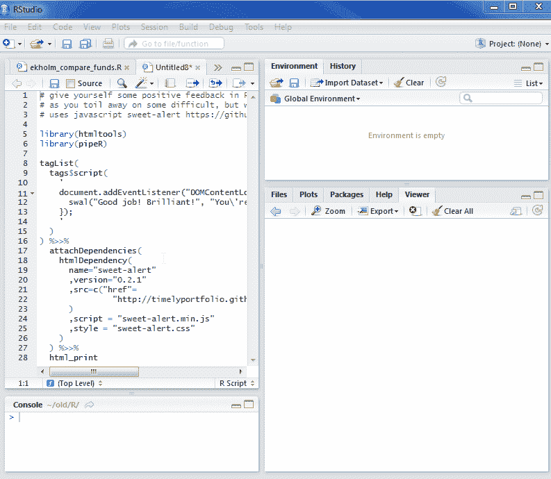

<!--yml
category: 未分类
date: 2024-05-18 14:50:59
-->

# Timely Portfolio: Postive Feedback in R with a Little Javascript

> 来源：[http://timelyportfolio.blogspot.com/2014/10/postive-feedback-in-r-with-little.html#0001-01-01](http://timelyportfolio.blogspot.com/2014/10/postive-feedback-in-r-with-little.html#0001-01-01)

Let’s face it, sometimes the struggle in R can become frustrating, depressing, daunting, or just monotonous.  For those moments when you need a little positive feedback, some encouragement, or a pat on the back, I thought this might help.  Maybe I should make this into a package.

I found this from [Sweet Alert for Bootstrap](http://lipis.github.io/bootstrap-sweetalert/) forked from [Tristan Edwards](https://twitter.com/t4t5) non-bootstrap [SweetAlert](http://tristanedwards.me/sweetalert).  This builds on the technique used in my previous post [SVG + a little extra (d3.js) in RStudio Browser | No Pipes This Time](http://timelyportfolio.blogspot.com/2014/10/svg-little-extra-d3js-in-rstudio.html).

[](https://blogger.googleusercontent.com/img/b/R29vZ2xl/AVvXsEhKxVbKOGAWY_ZOGmwaNMx5AQ5QDuQxmyElkn9oRQ6b0AFlldc1vx7yw8DBs6Tur4vWgPo4yQjRFssjRODQjIQ3Fl8RQBTAN0zLnl2084qWwM6zHICO1uT4y9M4yWU1uN25xfFTelBBOQ/s1600-h/positive_feedback_sweetalert_r%25255B9%25255D.gif)

```
# give yourself some positive feedback in R
# as you toil away on some difficult, but worthwhile task
# uses javascript sweet-alert https://github.com/t4t5/sweetalert

library(htmltools)
library(pipeR)

tagList(
  tags$script(
    '
    document.addEventListener("DOMContentLoaded", function(event) { 
      swal("Good job! Brilliant!", "You\'re doing worthwhile things.", "success")
    });
    '
  )
) %>>%
  attachDependencies(
    htmlDependency(
      name="sweet-alert"
      ,version="0.2.1"
      ,src=c("href"=
               "http://timelyportfolio.github.io/sweetalert/lib"
      )
      ,script = "sweet-alert.min.js"
      ,style = "sweet-alert.css"
    )
  ) %>>%
  html_print
```