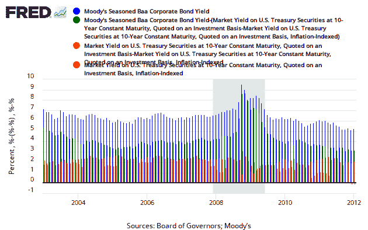

<!--yml
category: 未分类
date: 2024-05-18 15:09:08
-->

# Timely Portfolio: Quick Update on the Components of Bond Returns

> 来源：[http://timelyportfolio.blogspot.com/2012/01/quick-update-on-components-of-bond.html#0001-01-01](http://timelyportfolio.blogspot.com/2012/01/quick-update-on-components-of-bond.html#0001-01-01)

In [Real Squeeze](http://timelyportfolio.blogspot.com/2011/08/real-squeeze.html), [-1% Guaranteed Real Real Return! Yummy??](http://timelyportfolio.blogspot.com/2011/08/1-guaranteed-real-real-return-yummy.html), and [Historical Sources of Bond Returns](http://timelyportfolio.blogspot.com/2011/04/historical-sources-of-bond-returns.html), I offer some historical perspective on the only sources of bond returns: inflation, real returns, and credit.  Assuming no credit risk in US Treasuries (probably not a good assumption given this [Bloomberg quote on CDS on US Treasuries](http://www.bloomberg.com/quote/CT786916:IND)), the formula is fixed, and all inputs except inflation are provided ex-ante.  While bond prices can fluctuate wildly ([Extreme Bond Returns](http://timelyportfolio.blogspot.com/2012/01/extreme-bond-returns.html)), the experience over the life of a bond and a bond index is predetermined by the yield to maturity.  Unfortunately, that guaranteed experience in inflation or deflation is not so pleasant.

While everyone should know R, I understand that some readers would prefer an easier route.  [FRED](http://research.stlouisfed.org/fred2) as usual comes to the rescue.  Unfortunately though, labeling is not allowed.  The codes can be translated as follows:

*   DBAA = total return on BAA
*   DBAA – (DGS10 – DFII10) = credit return
*   DGS10 – DFII10 = inflation (expected)
*   DGS10 = real return

In the spirit of continuous improvement, here is the chart now using lattice and latticeExtra.

[R code now in GIST:](https://gist.github.com/1601483)