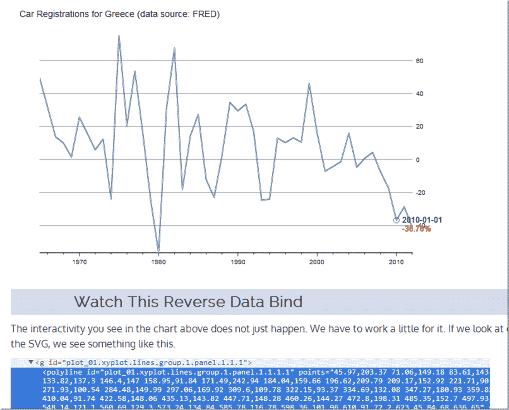

<!--yml
category: 未分类
date: 2024-05-18 14:58:22
-->

# Timely Portfolio: R/gridSVG/d3 Line Reverse Data Bind

> 来源：[http://timelyportfolio.blogspot.com/2013/08/rgridsvgd3-line-reverse-data-bind.html#0001-01-01](http://timelyportfolio.blogspot.com/2013/08/rgridsvgd3-line-reverse-data-bind.html#0001-01-01)

I veer from finance to tech, so let’s use some data from FRED/OECD this time.  I do not think I need to comment much on what has happened to New Car Registrations in Greece.

Reverse data binding a line plot from ggplot2 or lattice is slightly more difficult than what we saw in the last post [I Want ggplot2/lattice and d3 (gridSVG–The Glue)](http://timelyportfolio.blogspot.com/2013/08/gridsvganother-glue-for-r-to-svg.html).  Here is a quick tutorial on one way we can accomplish this.  Click on this [link](http://timelyportfolio.github.io/gridSVG_d3_line/) or the screenshot below.

As always, this is fully reproducible.  See the [code on Github](https://github.com/timelyportfolio/gridSVG_d3_line).