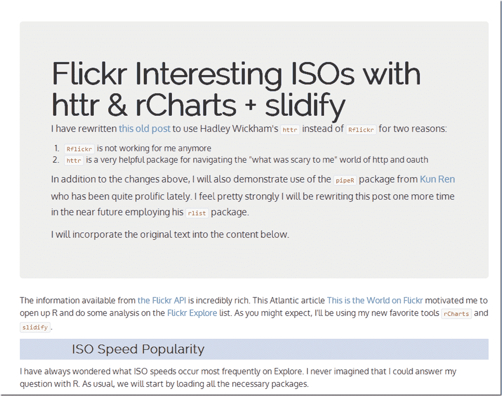

<!--yml
category: 未分类
date: 2024-05-18 14:52:22
-->

# Timely Portfolio: Refresh Old rCharts+flickr post with httr and pipeR

> 来源：[http://timelyportfolio.blogspot.com/2014/07/refresh-old-rchartsflickr-post-with.html#0001-01-01](http://timelyportfolio.blogspot.com/2014/07/refresh-old-rchartsflickr-post-with.html#0001-01-01)

The R world keeps moving, and I noticed [this old post](http://timelyportfolio.blogspot.com/2013/10/iso-popularity-on-flickr-explore.html) didn’t work anymore, so I have rewritten it to use Hadley Wickham's [`httr`](http://github.com/hadley/httr) instead of `Rflickr` for two reasons:

1.  `Rflickr` is not working for me anymore
2.  `httr` is a very helpful package for navigating the "what was scary to me" world of http and oauth

In addition to the changes above, I will also demonstrate use of the [`pipeR`](http://renkun.me/blog/2014/08/08/difference-between-magrittr-and-pipeR.html) package from [Kun Ren](http://renkun.me/) who has been quite prolific lately. I feel pretty strongly I will be rewriting this post one more time in the near future (already done) employing his [`rlist`](http://renkun.me/rlist/) package.

