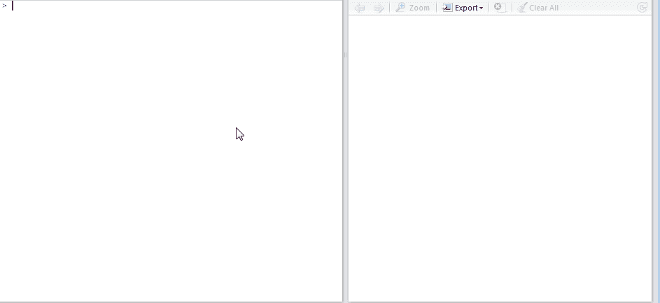
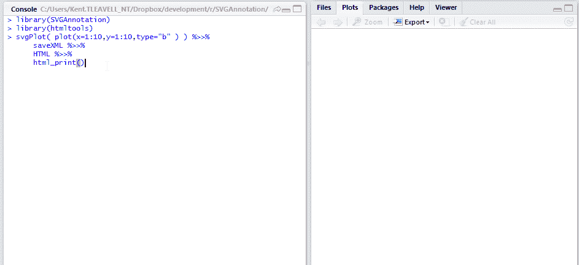
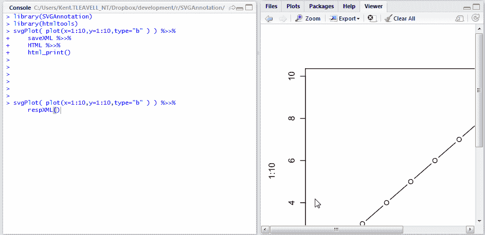

<!--yml
category: 未分类
date: 2024-05-18 14:51:28
-->

# Timely Portfolio: Responsive SVG in Your RStudio Browser

> 来源：[http://timelyportfolio.blogspot.com/2014/10/reponsive-svg-in-your-rstudio-browser.html#0001-01-01](http://timelyportfolio.blogspot.com/2014/10/reponsive-svg-in-your-rstudio-browser.html#0001-01-01)

For those readers who are unaware, SVG is absolutely amazing, and if you need some convincing see this 2009 paper/talk from David Dailey [Why is SVG Going to Be REALLY BIG?](http://www.svgopen.org/2009/papers/26-Why_is_SVG_going_to_be_REALLY_BIG_/)  Most R users should be very well acquainted with graphics and plots magically appearing on the screen with certain commands.  These graphics though are rasters, so when you resize, the graphics are re-rendered to scale.  Let’s have a look with a simple plot.

```
plot(x=1:10,y=1:10,type="b")
```

[](https://blogger.googleusercontent.com/img/b/R29vZ2xl/AVvXsEhLjD7-l6uFyEUsI0nsqmCHUO8T29m78Rd1XkjkY-1uO4ue5B_UAXcfQKtUKsycTF26y1gvMkQOcA0O2I-7BpTsY0p8l2C8ct4lZVSjnLdb4GgDYJ4l3080gfCiWQBUBTpHzTy9wx6zQA/s1600-h/R_raster_resize%25255B4%25255D.gif)

One of the beauties of SVG is that it will scale without re-rendering.  The old way to create SVG in R was to do something like this which produces an svg file that we can use, adjust, and share.

```
svg("svgplot.svg")
plot(x=1:10,y=1:10,type="b")
dev.off()
```

However, the integrated browser window in [RStudio](http://rstudio.com) combined with the [HTML helper tools](http://github.com/rstudio/htmltools)  from [RStudio](http://rstudio.com) lets us produce and see SVGs in real-time.  Let’s look again at our simple plot, but this time as an SVG in our RStudio browser window.  We will also use the precocious packages [SVGAnnotation](https://github.com/duncantl/SVGAnnotation) and [XML](http://cran.r-project.org/web/packages/XML/index.html) from Duncan Temple Lang.

[](https://blogger.googleusercontent.com/img/b/R29vZ2xl/AVvXsEjZH15LxxEGyGT6j4DB_4nOjynUAeJp5NkiZib53Hxo_PnfA6SVvh4NvX-cv-6nZP4etjPJ8LfBibXqaXKFNAiUMyyUpBryM1_ee0Dbz5lNP4zuPApsSm3iBYDesDeF_UIZAzGfDWkmbA/s1600-h/R_svg_1%25255B4%25255D.gif)

****But where is the magic resizability ?****

****This is where we will use some help from****

> ****Sara Soueidan - [Understanding SVG Coordinate Systems & Transformations (Part 1) – The viewport, viewBox, & preserveAspectRatio](http://sarasoueidan.com/blog/svg-coordinate-systems/)****

> ****Dudley Storey - [Make SVG Responsive](http://demosthenes.info/blog/744/Make-SVG-Responsive)****

****We can make a simple function to help us change the attributes and style to get a fancy responsive SVG real-time.****

```
**#even better make it responsive
#use this post as a guide
#http://demosthenes.info/blog/744/Make-SVG-Responsive
respXML <- function( svg_xml, height = NULL, width = "100%", print = T, ... ){
  # svg_xml should be an XML document
  library(htmltools)
  library(pipeR)
  library(XML)

  tags$div(
    style = paste(
      sprintf('width:%s;',width)
      ,ifelse(!is.null(height),sprintf('height:%s;',height),"")
      ,"display: inline-block;"
      ,"position: relative;"
      ,"padding-bottom: 100%;"
      ,"vertical-align: middle;"
      ,"overflow: hidden;"
    )
    , ...
    ,svg_xml %>>%
      (~svg ~
         structure(ifelse(
           length(getDefaultNamespace(svg)) > 0
           ,getNodeSet(svg,"//x:svg", "x")
           ,getNodeSet(svg,"//svg")
         ),class="XMLNodeSet") %>>%
         xmlApply(
          function(s){
             a = xmlAttrs(s)
             removeAttributes(s)
             xmlAttrs(s) <- a[-(1:2)]
             xmlAttrs(s) <- c(
               style = paste0(
                 #"height:100%;width:100%;"
                 "display: inline-block;"
                 #post says use these but will not fit viewer
                 #,"position: absolute;"
                 #,"top: 0;"
                 #,"left: 0;"
               )
               #,preserveAspectRatio="xMidYMid meet"
             )
           }
         )
      ) %>>%
      saveXML %>>%
      HTML
  ) %>>%
    ( ~ if(print) html_print(.) ) %>>% 
    ( return( invisible( . ) )  )**
```

****Let’s test our fancy new function.****

****[](https://blogger.googleusercontent.com/img/b/R29vZ2xl/AVvXsEiHJIra4LEmwDqGqayhMsilZb4LiZda01ia04kYPjtermBB1K3uTSMKMCAOxCM0PJVeGYMf6-dfTvbvqHBpI7vY8LXnQUztWuQCEbNxU-KPPl7K9TQKLi48MNIUAu7rg71Yw3PfUmPalQ/s1600-h/R_svg_2%25255B4%25255D.gif)****

****That’s more like it.  Let’s abandon the animated GIFs and embed a SVG below (copied/pasted straight from R into this post).  Resize your browser and test the result.****

****Actually, it appears I lied. The SVG does not resize like it would outside the Blogger container.  See [http://bl.ocks.org/timelyportfolio/raw/560e50e437d4bb1b9142/](http://bl.ocks.org/timelyportfolio/raw/560e50e437d4bb1b9142/ "http://bl.ocks.org/timelyportfolio/raw/560e50e437d4bb1b9142/") for the SVG in a standalone document for resizing.****

```
**# example using dotchart documentation
# in R graphics package
# ?graphics::dotchart
svgPlot(
  dotchart(
    t(VADeaths)
    , xlim = c(0,100)
    , main = "Death Rates in Virginia - 1940"
  )
) %>>%
  respXML**
```