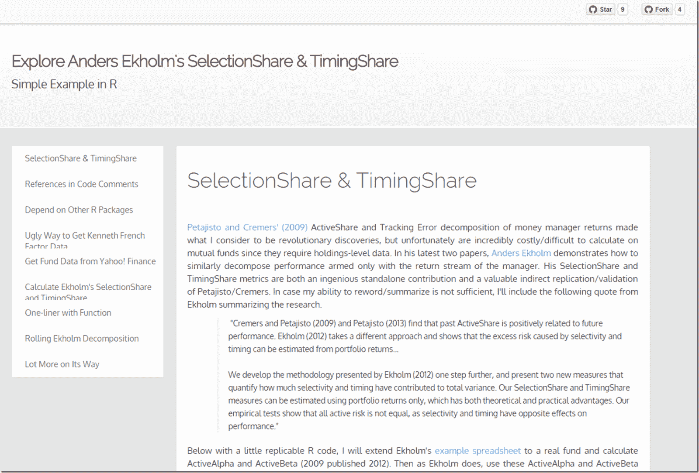

<!--yml
category: 未分类
date: 2024-05-18 14:51:46
-->

# Timely Portfolio: SelectionShare & TimingShare | Masterfully Written by Delightfully Responsive Author

> 来源：[http://timelyportfolio.blogspot.com/2014/10/selectionshare-timingshare-masterfully.html#0001-01-01](http://timelyportfolio.blogspot.com/2014/10/selectionshare-timingshare-masterfully.html#0001-01-01)

[Anders Ekholm](http://www.andersekholm.fi/) has written a wonderful paper

> Ekholm, Anders G.
> 
> Components of Portfolio Variance: Systematic, Selection and Timing
> 
> August 8, 2014
> 
> [http://ssrn.com/abstract=2463649](http://ssrn.com/abstract=2463649)

demonstrating how we might decompose a money manager’s performance with just a return stream.  Since his method relies simply on the return stream, he overcomes one of the biggest challenges of the Petajisto / Cremers’ related concepts of Active Share and Tracking Error which is the lack of data due to lagged infrequent reporting and high cost.  For other potential flaws in Active Share, see [this post](http://timelyportfolio.blogspot.com/2014/06/active-share-and-tracking-error-not.html) summarizing some very good [PIMCO research](http://media.pimco.com/Documents/PIMCO_Quantitative_Research_Active_Share_Tracking_Error_Sapra_Hun.pdf).

Also, fortunately for me and maybe my faithful readers, the author has been very kind and responsive helping me translate his example Excel sheet into R.  Click on the screenshot below for the full details with replicable code and example with a real live mutual fund.

Of course, this is simply the beginning of what will be a wonderful journey exploring both the simplicity and complexity of Ekholm’s brilliance.

