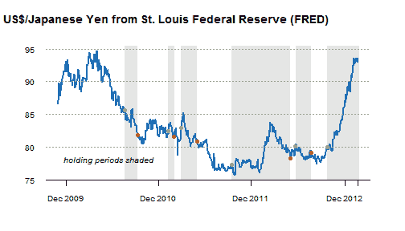

<!--yml
category: 未分类
date: 2024-05-18 15:01:13
-->

# Timely Portfolio: Shading and Points with xtsExtra plot.xts

> 来源：[http://timelyportfolio.blogspot.com/2013/02/shading-and-points-with-xtsextra-plotxts.html#0001-01-01](http://timelyportfolio.blogspot.com/2013/02/shading-and-points-with-xtsextra-plotxts.html#0001-01-01)

For some reason, I feel like have much better control with [plot.xts function](http://timelyportfolio.blogspot.com/search/label/plot.xts) from the [xtsExtra package](https://r-forge.r-project.org/scm/viewvc.php/pkg/xtsExtra/?root=xts) described [here](http://tradeblotter.wordpress.com/2012/11/23/xts-and-gsoc-2012/) over some of the other more refined R graphical packages. Maybe, it is just my simple mind, but recently I wanted to shade holding periods with points for buy and sale dates. With plot.xts from xtsExtra I was able to quickly and easily generate the following plot. I did have to slightly amend the original plot.xts function as seen [here](https://github.com/timelyportfolio/plotxts_shading_points/commit/1c245ba0878a5c5b1c09851903288c4515c68297), but it seemed more natural and like much less of a struggle.

I also enjoyed writing this post almost entirely in R markdown.

[R code from Github](https://raw.github.com/timelyportfolio/plotxts_shading_points/master/shading%20and%20points%20with%20xtsExtra%20plot.rmd):