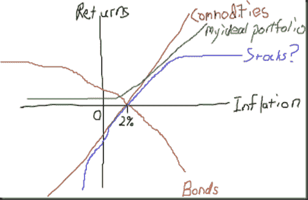

<!--yml
category: 未分类
date: 2024-05-18 15:25:00
-->

# Timely Portfolio: Simple Return Graph

> 来源：[http://timelyportfolio.blogspot.com/2011/01/simple-return-graph.html#0001-01-01](http://timelyportfolio.blogspot.com/2011/01/simple-return-graph.html#0001-01-01)

I just found and really enjoyed [http://thisisindexed.com](http://thisisindexed.com "http://thisisindexed.com").  Here is my first attempt.  The biggest enemy to any bond is inflation, and the lower the rate, the lower the defense against inflation.  See previous posts for thoughts on gold and bonds.

*30 minutes*