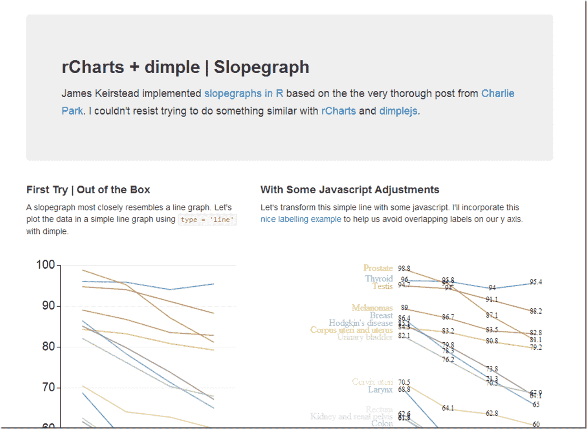

<!--yml
category: 未分类
date: 2024-05-18 14:54:45
-->

# Timely Portfolio: Slopegraphs | rCharts –> maybe finance versions

> 来源：[http://timelyportfolio.blogspot.com/2014/03/slopegraphs-rcharts-maybe-finance.html#0001-01-01](http://timelyportfolio.blogspot.com/2014/03/slopegraphs-rcharts-maybe-finance.html#0001-01-01)

Back in 2011, Charlie Park did two very thorough posts on Edward Tufte’s table graphics or slopegraphs.

> [http://charliepark.org/slopegraphs/](http://charliepark.org/slopegraphs/ "http://charliepark.org/slopegraphs/")
> 
> [http://charliepark.org/a-slopegraph-update/](http://charliepark.org/a-slopegraph-update/ "http://charliepark.org/a-slopegraph-update/")

These type graphics can provide very effective visualizations of finance and economic information.  For my first test though I will stick with cancer survivor data from this post [Slopegraphs in R | James Keirstead](http://www.jameskeirstead.ca/blog/slopegraphs-in-r/).  We can use a [dimplejs](http://dimplejs.org) line chart from [rCharts](http://rcharts.io) as our platform and add some javascript to do something similar.

If you know of any good finance or economics slopegraphs, please let me know and I might just try to recreate them.

Click here or on the image below to see the fully post

