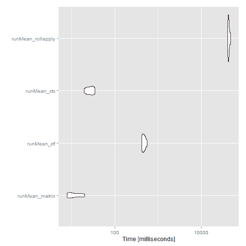
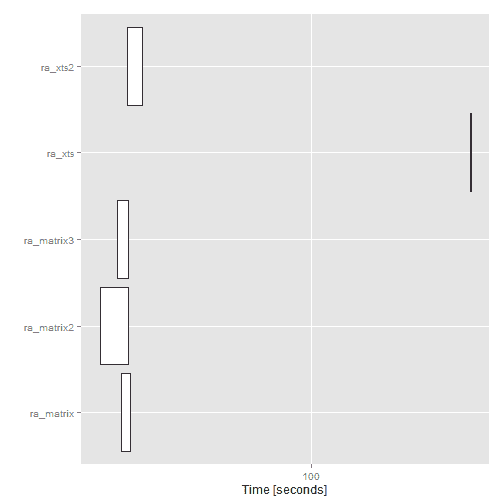

<!--yml
category: 未分类
date: 2024-05-18 14:52:53
-->

# Timely Portfolio: Speed Tests for Rolling/Running Functions

> 来源：[http://timelyportfolio.blogspot.com/2014/07/speed-tests-for-rollingrunning-functions.html#0001-01-01](http://timelyportfolio.blogspot.com/2014/07/speed-tests-for-rollingrunning-functions.html#0001-01-01)

I use rolling and running functions almost daily with financial time series. In my post [A Whole New World with Chains and Pipes](http://timelyportfolio.blogspot.com/2014/06/a-whole-new-r-world-with-chains-and.html), I made this statement

> I have noticed that rolling analysis with xts can sometimes be slow. as.matrix is my favorite way to speed things up, since I usually do not need xts powerful indexing and subsetting features.

I felt like I be a little more thorough, so I put together a couple of speed tests for running and rolling functions. Please let me know if there are ways to make these even speedier.

One method I had not seen was provided in the comments, so I promoted to the body of this post.

> Hi, there is also nice benchmark (for variable window width) provided here:[http://stackoverflow.com/quest...](http://stackoverflow.com/questions/21368245/performance-of-rolling-window-functions-in-r)

```
require(microbenchmark)
require(ggplot2)

require(xts)
require(quantmod)
require(PerformanceAnalytics)

require(dplyr);require(magrittr)

require(Gmisc)  #for pretty html tables 
```

#### Random Data | matrix, data.frame, and xts with dplyr

For our tests, let's make some random data with 10 columns of 100,000 rows. If this is daily financial data, 100,000 takes us back to about 1740\. I wish I had good data back to then. We'll create a `matrix`, `data.frame`, and `xts` object.

```
playData.matrix <- matrix(runif(1000000,-.03,.03), ncol=10)

playData.df <- 
  playData.matrix %>%
  as.data.frame %>% 
  tbl_df

#make some dates by adding days to the first day of 1740
#in a playful magrittr way (please don't do this at homr)
playDates <- 1:(playData.matrix %>% nrow) %>% as.Date(origin="1740-01-01")

#make an xts dataset with our playData with index playDates
playData.xts <- 
  playData.matrix %>%
  as.xts(order.by=playDates) 
```

#### Running | Beauty of Fortran

The [`ttr` authors](https://r-forge.r-project.org/projects/ttr/) have made the running functions really speedy with [Fortran and C](https://r-forge.r-project.org/scm/viewvc.php/pkg/src/?root=ttr).

```
mb_runMean <- microbenchmark(
  runMean_matrix = runMean(playData.matrix, n = 50 )
  ,runMean_df = runMean( playData.df, n = 50 )
  ,runMean_xts = runMean( playData.xts, n = 50 )
  #show the beauty of Fortran in the above runMean calcs
  ,runMean_rollapply = rollapply(playData.matrix, width = 50, by = 1, FUN="mean")
,times=10L) 
```

##### runMean microbenchmark results

| summary | expr | min | lq | median | uq | max | neval |
| --- | --- | --- | --- | --- | --- | --- | --- |
| 1 | runMean_matrix | 7.83479 | 8.328931 | 10.187089 | 15.631568 | 20.428914 | 10 |
| 2 | runMean_df | 415.200526 | 436.36685 | 463.7532645 | 504.178149 | 565.733628 | 10 |
| 3 | runMean_xts | 19.379056 | 22.689037 | 27.419294 | 31.679356 | 34.873025 | 10 |
| 4 | runMean_rollapply | 40530.101527 | 41679.322495 | 42675.2747235 | 43917.396031 | 47993.732396 | 10 |



#### Rolling | I Miss Fortran

Rolling functions get a lot slower without Fortran and C. However, we can convert with `as.matrix` or `as.numeric` to speed things up a little bit. Once we're done calculating we will need to convert back to `xts` with a little date logic.

```
mb_rollapply <- microbenchmark(
  ra_matrix = rollapply( playData.matrix[,1:2], width = 100 , by = 1, FUN="Omega" )

  ,ra_matrix2 = apply(
    playData.matrix[,1:2],
    MARGIN=2,
    FUN=function(col){ return(rollapply(col,width = 100 , by = 1, FUN="Omega" )) }
  )

  ,ra_xts = rollapply( playData.xts[,1:2], width = 100 , by = 1, FUN="Omega" )

  ,ra_xts2 = apply(
    playData.xts[,1:2],
    MARGIN=2,
    FUN=function(col){
      return(
        rollapply(
          as.numeric(col)
          ,width=100
          ,by=1
          ,FUN="Omega"
        )
      )
    }
  )
,times=2L) 
```

##### rollapply microbenchmark results

| summary | expr | min | lq | median | uq | max | neval |
| --- | --- | --- | --- | --- | --- | --- | --- |
| 1 | ra_matrix | 26.001762182 | 26.001762182 | 26.8966084855 | 27.791454789 | 27.791454789 | 2 |
| 2 | ra_matrix2 | 22.331454712 | 22.331454712 | 24.8568809085 | 27.382307105 | 27.382307105 | 2 |
| 3 | ra_matrix3 | 25.255073874 | 25.255073874 | 26.3310039035 | 27.406933933 | 27.406933933 | 2 |
| 4 | ra_xts | 308.954120943 | 308.954120943 | 309.3609896875 | 309.767858432 | 309.767858432 | 2 |
| 5 | ra_xts2 | 27.154306816 | 27.154306816 | 28.6303421355 | 30.106377455 | 30.106377455 | 2 |

