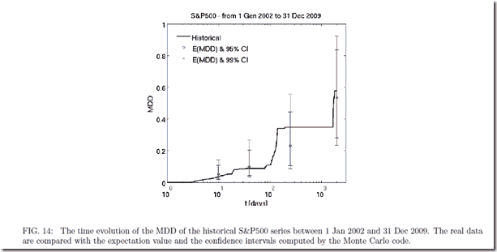
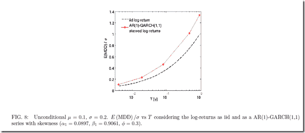
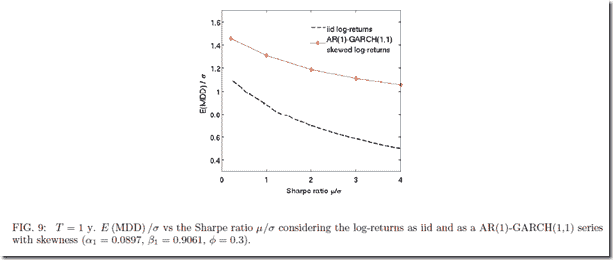
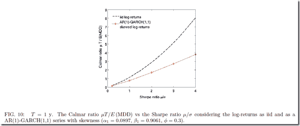

<!--yml
category: 未分类
date: 2024-05-18 15:06:15
-->

# Timely Portfolio: Statistics of Drawdown–paper and post

> 来源：[http://timelyportfolio.blogspot.com/2012/06/statistics-of-drawdownpaper-and-post.html#0001-01-01](http://timelyportfolio.blogspot.com/2012/06/statistics-of-drawdownpaper-and-post.html#0001-01-01)

Thank so much to Patrick Burns’ post [Variability in maximum drawdown](http://www.portfolioprobe.com/2012/06/04/variability-in-maximum-drawdown/).  He starts with “Maximum drawdown is blazingly variable,” which I say is why money management is so blazingly difficult.  After spending a lot of time thinking about his post and trying to replicate the referenced paper

> Casati, Alessandro, About the Statistics of the Maximum Drawdown in Financial Time Series (May 1, 2012). Available at SSRN: [http://ssrn.com/abstract=2049584](http://ssrn.com/abstract=2049584) or [http://dx.doi.org/10.2139/ssrn.2049584](http://dx.doi.org/10.2139/ssrn.2049584)

I think that the cumulative statistics, both total return and drawdown, fit well with the comment “The pictures imply that the maximum drawdown could have been pretty much anything.” Here is one of the figures that leads to this conclusion, and the predicted confidence interval from 20% to 90% is incredibly wide and not all that helpful.  If someone was willing to pay me for the bet that over the next 1,000 days, the S&P 500 or really any equity index drawdown falls between 20% and 90%, I would be happy to take that bet, and I would not need sophisticated statistical techniques to give me that insight.

Although I do not replicate the paper exactly with the most obvious difference that I use monthly returns 1950-May 2012 rather than daily returns 2002-2009, we can evaluate both return and drawdown through density plots with multiple distribution methods.  I limited my simulation to 10,000 samples so that I would not be up all night, but 10,000 is sufficient to show that over 62 years, both cumulative return and max drawdown can be virtually anything and both are “blazingly variable.”  I wonder how this would compare with life with sickness/death as drawdown and age of death as cumulative return.

To be fair, let’s annualize the cumulative returns (actually probably better to do over 5 to 20 year periods).

Independent of the outcome, I really enjoyed the paper’s Figures 8, 9, and 10 getting me one step closer to the question posed in my post [Is Drawdown the Biggest Determinant of System Success?](http://timelyportfolio.blogspot.com/2011/12/is-drawdown-biggest-determinant-of.html)

We do see a relationship between return and drawdown.

If nothing else, I was delighted to see a discussion of the often ignored drawdown statistic, which is the key to every investment decision I make.

[R code from GIST:](https://gist.github.com/2913982)