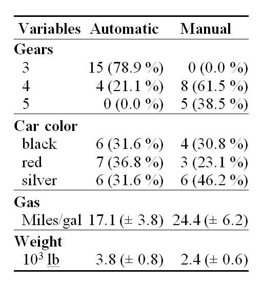
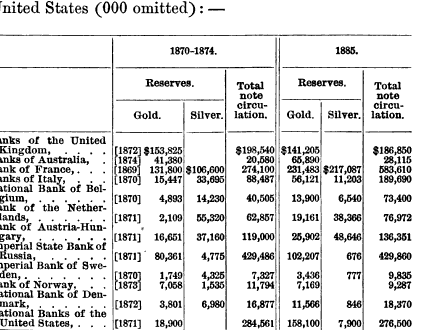

<!--yml
category: 未分类
date: 2024-05-18 15:00:32
-->

# Timely Portfolio: Tables Are Like Cockroaches

> 来源：[http://timelyportfolio.blogspot.com/2013/04/tables-are-like-cockroaches.html#0001-01-01](http://timelyportfolio.blogspot.com/2013/04/tables-are-like-cockroaches.html#0001-01-01)

As much as I would like to completely replace all tables with beautiful, intuitive, and interactive charts, tables like cockroaches cannot be eliminated. Based on this very [interesting discussion on the Perceptual Edge forum](http://sfew.websitetoolbox.com/post/Old-or-oldest-data-table-5702966) with source [Exploring the Origins of Tables for Information Visualization](http://api.viglink.com/api/click?format=go&key=ccc2217bc2b75c4bdf5f7e57267f0464&loc=http%3A%2F%2Fsfew.websitetoolbox.com%2Fpost%2FOld-or-oldest-data-table-5702966&v=1&libid=1365001395530&out=http%3A%2F%2Fcsis.pace.edu%2F%7Emarchese%2FPapers%2FIV11%2FMarchese_IV%252711.pdf&ref=http%3A%2F%2Fwww.google.com%2Furl%3Fsa%3Dt%26rct%3Dj%26q%3D%26esrc%3Ds%26frm%3D1%26source%3Dweb%26cd%3D2%26ved%3D0CDoQFjAB%26url%3Dhttp%253A%252F%252Fsfew.websitetoolbox.com%252Fpost%252FOld-or-oldest-data-table-5702966%26ei%3DpERcUcvxPImY9QTKi4GwCg%26usg%3DAFQjCNFppNIFLhtMVC3W9Xklbffh8lAmlA%26sig2%3DJ9ehhR3U1vkGtjw8d4sxLA%26bvm%3Dbv.44697112%2Cd.eWU&title=Old%20or%20oldest%20data%20table%20-%20Perceptual%20Edge%20Discussion%20Forum&txt=Exploring%20the%20Origins%20of%20Tables%20for%20Information%20Visualization&jsonp=vglnk_jsonp_136500185877710), tables date back to 1850 BCE. The paper concludes with

> As part of exploration, tables help answer questions about data. As exemplars of communication, tables provide effective means for presenting data - each table has a story or stories to tell.

After struggling to create some attractive tables in HTML with R, I'm not sure they are any easier to create almost 4,000 years later. LaTeX is the clear winner when it comes to the table making competition. I have used **xtable** for HTML tables, but it could not fully produce a complicated table.  I was delighted to recently find the [**Gmisc**](http://gforge.se/2013/02/tables-from-r-into-word/) package, which is the result of a frustrated orthopaedic surgeon's need to create tables in Word for journal submission.

[](http://gforge.se/2013/02/tables-from-r-into-word/)

Another R to Word workflow was also discussed in [Writing a MS-Word document using R (with as little overhead as possible)](http://www.r-statistics.com/2013/03/write-ms-word-document-using-r-with-as-little-overhead-as-possible/). I was not aware of the need to produce a Word .doc from R. I simply thought creating an html table should not be that hard.

If you read [Old Price Tables in Modern d3 Visualization](http://timelyportfolio.blogspot.com/2013/04/old-price-tables-in-modern-d3.html) and [Dust off 130 Year Old Gold Books on Google Bookshelf](http://timelyportfolio.blogspot.com/2013/03/dust-off-130-year-old-gold-books-on.html), you'll know that my new favorite book is [Gold and Prices Since 1873 by James Laurence Laughlin](http://books.google.com/books?id=UFMuAAAAYAAJ&printsec=frontcover#v=thumbnail&q&f=false). This table on page 26 seems easy enough to recreate.



I had no idea how recreating this table would test and enhance my R skills. I started by manually entering the data since OCR did not work.

```
reps = c("http://ftp.sunet.se/pub/lang/CRAN", "http://cran.gforge.se")
install.packages("Gmisc", repos = reps, dependencies = TRUE) 
```

```
library(Gmisc, verbose = FALSE)

# manually enter the data in a data frame
data1874 <- data.frame(c(1872, 1874, 1869, 1870, 1870, 1871, 1871, 1871, 1870, 
    1873, 1872, 1871), c(153825, 41380, 131800, 15447, 4893, 2109, 16651, 80361, 
    1749, 7058, 3801, 18900), c(0, 0, 106600, 33695, 14230, 55320, 37160, 4775, 
    4325, 1535, 6980, 0), c(198540, 20580, 274100, 88487, 40505, 62857, 119000, 
    429486, 7327, 11794, 16877, 284561))

rownames(data1874) <- c("Banks of the United Kingdom", "Banks of Australia", 
    "Banks of France", "Banks of Italy", "National Bank of Belgium", "Bank of the Netherlands", 
    "Bank of Austria-Hungary", "Imperial State Bank of Russia", "Imperial Bank of Sweden", 
    "Bank of Norway", "National Bank of Denmark", "National Bank of the United States")
colnames(data1874) <- c(" ", "Gold", "Silver", "Total Note Circulation")

data1885 <- data.frame(c(141205, 65890, 231483, 56121, 13900, 19161, 25902, 
    102207, 3436, 7169, 11566, 158100), c(0, 0, 217087, 11203, 6540, 38366, 
    48646, 676, 777, 0, 846, 7900), c(186850, 28115, 583610, 189690, 73400, 
    76972, 136351, 429860, 9835, 9287, 18370, 276500))
colnames(data1885) <- colnames(data1874)[2:4]

# get sums for totals row in table
data1874[NROW(data1874) + 1, ] = apply(data1874, MARGIN = 2, FUN = sum)
data1885[NROW(data1885) + 1, ] = apply(data1885, MARGIN = 2, FUN = sum)
# add Total to row names
rownames(data1874)[NROW(data1874)] = "Total"
rownames(data1885)[NROW(data1885)] = "Total"
# eliminate the sum of years which does not make sense
data1874[NROW(data1874), 1] = ""

# get commas in the numbers
data1874[, 2:4] <- format(data1874[, 2:4], big.mark = ",")
data1885 <- format(data1885, big.mark = ",") 
```

Then with **gmisc** I very quickly achieved a decent table.

```
# use htmlTable to produce a table
htmlTable(cbind(data1874, data1885), caption = "", rowlabel = "", cgroup = c("Reserves", 
    "", "Reserves", ""), n.cgroup = c(3, 1, 2, 1, 0), ctable = TRUE, output = TRUE) 
```

|  | Reserves |   |   |   | Reserves |   |   |
| --- | --- | --- | --- | --- | --- | --- | --- |
|   |  | Gold | Silver |   | Total Note Circulation |   | Gold | Silver |   | Total Note Circulation |
| --- | :-: | :-: | :-: | --- | :-: | --- | :-: | :-: | --- | :-: |
| Banks of the United Kingdom | 1872 | 153,825 | 0 |   | 198,540 |   | 141,205 | 0 |   | 186,850 |
| Banks of Australia | 1874 | 41,380 | 0 |   | 20,580 |   | 65,890 | 0 |   | 28,115 |
| Banks of France | 1869 | 131,800 | 106,600 |   | 274,100 |   | 231,483 | 217,087 |   | 583,610 |
| Banks of Italy | 1870 | 15,447 | 33,695 |   | 88,487 |   | 56,121 | 11,203 |   | 189,690 |
| National Bank of Belgium | 1870 | 4,893 | 14,230 |   | 40,505 |   | 13,900 | 6,540 |   | 73,400 |
| Bank of the Netherlands | 1871 | 2,109 | 55,320 |   | 62,857 |   | 19,161 | 38,366 |   | 76,972 |
| Bank of Austria-Hungary | 1871 | 16,651 | 37,160 |   | 119,000 |   | 25,902 | 48,646 |   | 136,351 |
| Imperial State Bank of Russia | 1871 | 80,361 | 4,775 |   | 429,486 |   | 102,207 | 676 |   | 429,860 |
| Imperial Bank of Sweden | 1870 | 1,749 | 4,325 |   | 7,327 |   | 3,436 | 777 |   | 9,835 |
| Bank of Norway | 1873 | 7,058 | 1,535 |   | 11,794 |   | 7,169 | 0 |   | 9,287 |
| National Bank of Denmark | 1872 | 3,801 | 6,980 |   | 16,877 |   | 11,566 | 846 |   | 18,370 |
| National Bank of the United States | 1871 | 18,900 | 0 |   | 284,561 |   | 158,100 | 7,900 |   | 276,500 |
| Total |  | 477,974 | 264,620 |   | 1,554,114 |   | 836,140 | 332,041 |   | 2,018,840 |

However, the complicated multiple row heading was still missing, so here is the much harder brute force work to parse the HTML to get the table structured correctly.

```
# do all the hard work to make the table more of an exact replica
gtable_table <- htmlTable(cbind(data1874, data1885), caption = "", rowlabel = "", 
    cgroup = c("Reserves", "", "Reserves", ""), n.cgroup = c(3, 1, 2, 1, 0), 
    ctable = TRUE, output = FALSE)

require(XML)
# parse the table so that we can access the elements in a very crude
# manner
doc <- htmlParse(gtable_table)
# add another row heading to the table with XML
temp <- addChildren(getNodeSet(doc, "//thead")[[1]], newXMLNode("tr", list(newXMLNode("th", 
    attrs = list(colspan = "1", style = "font-weight: 900; border-top: 2px solid grey;border-right: 1px solid grey;"), 
    text = ""), newXMLNode("th", attrs = list(colspan = "6", style = "font-weight: 900; border-top: 2px solid grey;"), 
    text = "1870-1874"), newXMLNode("th", attrs = list(colspan = "5", style = "font-weight: 900; border-top: 2px solid grey;"), 
    text = "1885"))), at = 0)

# add some vertical borders; wish this were easier but very manual
th <- getNodeSet(doc, "//thead//th")  #start with the th elements in thead
for (i in c(1, 2, 4, 8, 12, 18)) {
    oldstyle <- xmlAttrs(th[[i]])["style"]  #get the old style attribute
    removeAttributes(th[[i]], attrs = "style")  #remove the style attribute
    addAttributes(th[[i]], style = paste(oldstyle, "border-right: 1px solid grey;", 
        sep = ""))  #add the old style attribute concatenated with border-right
}

th <- getNodeSet(doc, "//tbody//td")  #now do the td elements in tbody
for (i in c(seq(1, 133, by = 11), seq(7, 139, by = 11))) {
    oldstyle <- xmlAttrs(th[[i]])["style"]  #get the old style attribute
    removeAttributes(th[[i]], attrs = "style")  #remove the style attribute
    addAttributes(th[[i]], style = paste(oldstyle, "border-right: 1px solid grey;", 
        sep = ""))  #add the old style attribute concatenated with border-right
}

# although htmlTable will group rows, I could not make it do what I wanted
# so add underline before the total row
for (i in 133:143) {
    oldstyle <- xmlAttrs(th[[i]])["style"]  #get the old style attribute
    removeAttributes(th[[i]], attrs = "style")  #remove the style attribute
    addAttributes(th[[i]], style = paste(oldstyle, "border-top: 1px solid grey;", 
        sep = ""))  #add the old style attribute concatenated with border-top
}

# for some reason &nbsp; becomes Â, so reverse it back to $nbsp;
returnHTML <- gsub("[Â].", replacement = "&nbsp;", saveXML(getNodeSet(doc, "//table")[[1]]))

# not sure if necessary but free up doc from memory
free(doc)

cat(returnHTML) 
```

|  | 1870-1874 | 1885 |
| --- | --- | --- |
|  | Reserves |   |   |   | Reserves |   |   |
| --- | --- | --- | --- | --- | --- | --- | --- |
|   |  | Gold | Silver |   | Total Note Circulation |   | Gold | Silver |   | Total Note Circulation |
| --- | :-: | :-: | :-: | --- | :-: | --- | :-: | :-: | --- | :-: |
| Banks of the United Kingdom | 1872 | 153,825 | 0 |   | 198,540 |   | 141,205 | 0 |   | 186,850 |
| Banks of Australia | 1874 | 41,380 | 0 |   | 20,580 |   | 65,890 | 0 |   | 28,115 |
| Banks of France | 1869 | 131,800 | 106,600 |   | 274,100 |   | 231,483 | 217,087 |   | 583,610 |
| Banks of Italy | 1870 | 15,447 | 33,695 |   | 88,487 |   | 56,121 | 11,203 |   | 189,690 |
| National Bank of Belgium | 1870 | 4,893 | 14,230 |   | 40,505 |   | 13,900 | 6,540 |   | 73,400 |
| Bank of the Netherlands | 1871 | 2,109 | 55,320 |   | 62,857 |   | 19,161 | 38,366 |   | 76,972 |
| Bank of Austria-Hungary | 1871 | 16,651 | 37,160 |   | 119,000 |   | 25,902 | 48,646 |   | 136,351 |
| Imperial State Bank of Russia | 1871 | 80,361 | 4,775 |   | 429,486 |   | 102,207 | 676 |   | 429,860 |
| Imperial Bank of Sweden | 1870 | 1,749 | 4,325 |   | 7,327 |   | 3,436 | 777 |   | 9,835 |
| Bank of Norway | 1873 | 7,058 | 1,535 |   | 11,794 |   | 7,169 | 0 |   | 9,287 |
| National Bank of Denmark | 1872 | 3,801 | 6,980 |   | 16,877 |   | 11,566 | 846 |   | 18,370 |
| National Bank of the United States | 1871 | 18,900 | 0 |   | 284,561 |   | 158,100 | 7,900 |   | 276,500 |
| Total |  | 477,974 | 264,620 |   | 1,554,114 |   | 836,140 | 332,041 |   | 2,018,840 |

This can be even further improved with some simple CSS.  I hope this helps somebody.  Oh, I just also remembered [dprint](http://user2010.org/slides/Brickner+Slavov+Napoli.pdf) which I will revisit soon. For now I think I'll go back to making graphs.