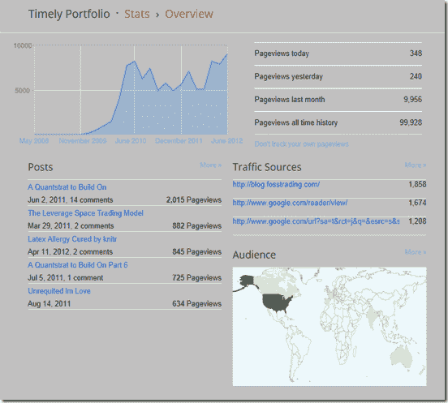

<!--yml
category: 未分类
date: 2024-05-18 15:05:50
-->

# Timely Portfolio: Turning 100,000

> 来源：[http://timelyportfolio.blogspot.com/2012/06/turning-100000.html#0001-01-01](http://timelyportfolio.blogspot.com/2012/06/turning-100000.html#0001-01-01)

#### Way back in December 2010, I started blogging here at Timely Portfolio, and as you can see, turning 100,000 pageviews was something I never expected.  Thanks to all the readers who have motivated me to continue and who have taught me along the way.

> **Wednesday, December 8, 2010**
> 
> ##### Reading->Writing
> 
> I am determined to play not spectate. After 20 years of voracious reading, I have decided to write, and this blog represents my commitment. More than likely it will be a reflection of me, so a lot about my work/passion money management and markets but also hopefully some worthwhile thoughts and observations. I will be the writer and possibly the only reader ultimately but I know that I will benefit immensely from this project. Any benefit to others will be extremely gratifying and help resolve my debt to all the wonderful authors that have entertained and enlightened me over the years.

The stats look like this.

