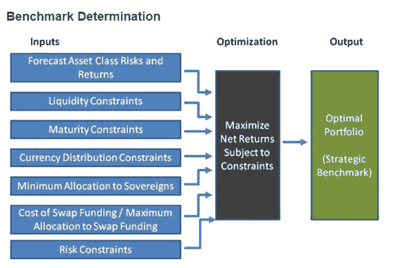

<!--yml
category: 未分类
date: 2024-05-18 14:50:14
-->

# Timely Portfolio: Widgets For Christmas

> 来源：[http://timelyportfolio.blogspot.com/2014/12/widgets-for-christmas.html#0001-01-01](http://timelyportfolio.blogspot.com/2014/12/widgets-for-christmas.html#0001-01-01)

For Christmas, I generally want electronic widgets, but after [six months of development](https://github.com/ramnathv/htmlwidgets/commit/9b39806e6dfb3105cd875aa7103190ba2c3f98ab), all I wanted this Christmas was [htmlwidgets](http://www.htmlwidgets.org), and Santa [RStudio](http://rstudio.com/)/jj,joe,yihui and Santa [Ramnath](https://github.com/ramnathv) delivered early with this RStudio tweet on December 17th.

The major benefit of htmlwidgets is it provides all three methods of bridging R with JavaScript/HTML mentioned in my Aug. 16, 2013 post [I Want ggplot2/lattice and d3 (gridSVG–The Glue)](http://timelyportfolio.blogspot.com/2013/08/gridsvganother-glue-for-r-to-svg.html).  For htmlwidgets to be successful though, not only do htmlwidgets need to work, [easy creation of widgets is absolutely essential](http://www.htmlwidgets.org/develop_intro.html).

As a quick example, we can look at the [DiagrammeR](http://github.com/rich-iannone/DiagrammeR) package released yesterday by [Richard Iannone](http://about.me/rich_i/).  DiagrammeR [launched](https://github.com/rich-iannone/DiagrammeR/commit/656116cc73941f176e93c88990603b2d5ebf38a5) in non-htmlwidgets form severely hampering its ability to be easily used in multiple contexts.  Converting it to htmlwidgets seemed like a great opportunity to illustrate both the ease of htmlwidgets creation and the powerful infrastructure offered by htmlwidgets.  So, in a couple hours—easy to create, check—yesterday (most of the time spent on examples, documentation, and testing) with only a [couple of lines of JavaScript](https://github.com/rich-iannone/DiagrammeR/blob/master/inst/htmlwidgets/DiagrammeR.js#L23-L40)—easy to create, check again—I was able to transform the DiagrammeR package into htmlwidgets.

I thought a finance diagram would be a great example for this blog, so off to Google Images I went looking for a good and also simple application and chose [this](http://www.fin.gc.ca/treas/evaluations/eaafefa-ecracfc-eng.asp) from the Department of Finance Canada.

Here is what it looks like with DiagrammeR + mermaid.js.

If I can come up with the resolve and commitment, I might have an announcement for 2015 – the year of the widget.

Happy New Year, and thanks for 4 good years of TimelyPortfolio.