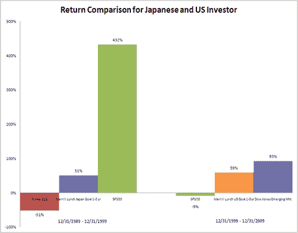

<!--yml
category: 未分类
date: 2024-05-18 15:25:51
-->

# Timely Portfolio: Wise Japanese Investor? Wise US Investor?

> 来源：[http://timelyportfolio.blogspot.com/2011/01/wise-japanese-investor-wise-us-investor.html#0001-01-01](http://timelyportfolio.blogspot.com/2011/01/wise-japanese-investor-wise-us-investor.html#0001-01-01)

Investors of a country do not have to suffer the same fate as the country in which they reside.  Free markets allow an investor to make a investment independent of their country of residence.

If a Japanese investor switches from the Nikkei to short-term Japanese Government Bonds at the height of the Japanese equity bubble in December 1989, the investor is celebrated as a hero and lauded as one of the greatest investors of all time.  However, if the Japanese investor expanded the opportunity set and included United States stocks, the Japanese investor would have truly shown amazing wisdom.

*source: Bloomberg, Dow Jones, S&P, and Merrill Lynch/Bank of America*

The US investor that sold stocks in December 1999 and switched to short-term US bonds would be called a superinvestor, but that narrow-minded decision was not the best.

Let’s look at a real superhero investor who switched investment allocation 3 times over the last 30 years.  This superinvestor bought Japanese stocks on 12/31/79, US stocks 12/31/89, and emerging market stocks 12/31/99.  This superinvestor would have achieved a 1050% return (16.6% annualized) over the last 30 years from 1979-2009.

*1 hour*